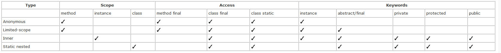

# Chương 15 Bàn luận về lớp lồng nhau - Nested Classes

Một khía cạnh của ngôn ngữ Java không được hiểu rộng rãi là khái niệm về các lớp lồng nhau. Các lớp này cho phép bạn giới hạn toàn bộ một lớp trong một phạm vi giới hạn của một lớp hoặc phương thức khác. Khái niệm lồng một lớp trong một lớp hoặc phương thức khác đưa ra các vấn đề độc nhất không tìm thấy ở nơi khác trong lập trình hướng đối tượng. Không phải tất cả các loại lớp lồng nhau đều nên được sử dụng thường xuyên, vì vậy bạn có thể sẽ gặp hầu hết chúng trong mã của người khác. Do đó, điều quan trọng là bạn phải hiểu cách hoạt động của các lớp lồng nhau khác nhau.

Các lớp lồng nhau thuộc một trong ba loại cơ bản:

- Các lớp bên trong (Inner classes)
- Các lớp bên trong phạm vi giới hạn (Limited-scope inner classes)
- Các lớp lồng nhau tĩnh (Static nested classes)

Mỗi danh mục này có các quy tắc truy cập và cách sử dụng riêng.

## 15.1 Các lớp bên trong (Inner classes)

Đầu tiên tôi sẽ đưa ra 2 ví dụ nói về phạm vi của Inner classes:

ví dụ 1:

```java
public class InnerClassDemo extends JDialog {

  private static final String LOGO = "LOGO";
  private int beepCount = 0;

  public InnerClassDemo(final int beepCount) {
    super( );
    setTitle("Anonymous Demo");
    contentPane = getContentPane( );
    contentPane.setLayout(new BorderLayout( ));
    JLabel logoLabel = new JLabel(LOGO);
    contentPane.add(BorderLayout.NORTH, logoLabel);
    JButton btn = new BeepButton("Beep");
    contentPane.add(BorderLayout.SOUTH, btn);
    pack( );
    this.beepCount = beepCount;
  }

  private class BeepButton extends JButton implements ActionListener {
    public BeepButton(final String text) {
      super(text);
      addActionListener(this);
    }

    public void actionPerformed(final ActionEvent event) {
      try {
        for(int count = 0; count < beepCount; count++) {
          Toolkit.getDefaultToolkit().beep( );
          Thread.sleep(100);
        }
      } catch (final InterruptedException ex) {
        throw new RuntimeException(ex);
      }
    }
  }
}
```

lớp BeepButton là một lớp trong của InnerClassDemo. bạn có thể thấy được trong lớp BeepButton cụ thể là function actionPerformed nó đã dùng một biến beepCount mặc dù nó không khai báo ở trong function này. Ở đây tôi muốn nhấn mạnh một điều là Inner class được coi là một thành phần của class và nó có quyền được truy cập đến tất cả các thành phần trong lớp bao của nó.

Thêm một chú ý nữa là BeepButton được khai báo private nên phạm vi của nó chỉ hoạt động bên trong lớp InnerClassDemo. và ta không thể khai báo nó bên ngoài lớp.

Vậy nếu như đổi private thành public thì sao. Đây là nguyên nhân để tôi đưa ra ví dụ thứ 2:

```java
public class MonitorScreen {

    public class PixelPoint {

        private int x;
        private int y;

        public PixelPoint(final int x, final int y) {
            this.x = x;
            this.y = y;
        }

        public int getX() {
            return x;
        }

        public int getY() {
            return y;
        }
    }
}
```

vậy phái bên ngoài lớp MonitorScreen bạn tạo một instance PixelPoint như thế nào

```java
MonitorScreen.PixelPoint obj = new MonitorScreen.PixelPoint();
```

Lệnh này sẽ bị lỗi ngay lập tức. ở đây muốn tạo một instance PixelPoint bạn bắt buộc phải tạo một instance MonitorScreen trước và đại loại trông nó như thế này:

```java
MonitorScreen screen = new MonitorScreen();
MonitorScreen.PixelPoint pixel = screen.new PixelPoint(25, 40);
System.out.println(pixel.getX());
System.out.println(pixel.getY());
```

nhìn kỹ lại **`screen.new PixelPoint(25, 40);`** bạn ko nhìn nhầm đâu. nó thực sự kì lạ có gì đó sai sai. thực tế là code đúng đấy. Tuy nhiên nó lại vi phạm vào nguyên tắc lập trình hướng đối tượng vài vậy tôi không khuyến khích bạn dùng public cho một class bên trong một class khác.

### 15.1.2 Cấu trúc phân cấp của các lớp bên trong

Xem ví dụ dưới đây

```java
public abstract class BasicMonitorScreen {

  private Dimension resolution;

  public BasicMonitorScreen(final Dimension resolution) {
    this.resolution = resolution;
  }

  public Dimension getResolution( ) {
    return this.resolution;
  }

  protected abstract class PixelPoint {
    private int x;
    private int y;

    public PixelPoint(final int x, final int y) {
      this.x = x;
      this.y = y;
    }

    public int getX( ) {
      return x;
    }

    public int getY( ) {
      return y;
    }
  }
}
```

Ở đây lớp bao là một lớp trừu tượng và lóp bên trong PixelPoint có thể là một lớp cụ thể hoặc một lớp trừu tượng. Tuy nhiên, trong trường hợp lớp trong là một lớp trừ tượng thì `hãy đảm bảo rằng một lớp bên trong trừu tượng không làm cho lớp bao quanh trở nên trừu tượng, như với một phương thức trừu tượng`.

dưới đây tôi sẽ cung cấp ví dụ về việc mở rộng trên lớp cơ sở trừ tượng

```java
public class ColorMonitorScreen extends BasicMonitorScreen {

        public ColorMonitorScreen(Dimension resolution) {
                super(resolution);
        }

        protected class ColorPixelPoint extends PixelPoint {

                private Color color;

                public ColorPixelPoint(final int x, final int y, final Color color) {
                        super(x, y);
                        this.color = color;
                }

                public Color getColor() {
                        return this.color;
                }
        }
}
```

Tạo các lớp cụ thể trong một lớp cơ sở trừu tượng là một cách tốt để mô hình hóa các mối quan hệ thành phần trong một hệ thống phân cấp kế thừa. Bạn có thể khai báo các lớp đã soạn trong lớp cơ sở và cho phép các lớp con sử dụng lớp đã soạn đó.

Lớp bên trong có thể là một lóp public tuy nhiên tôi không khuyến khích điều này đó là một ý tưởng tồi.

## 15.2 Các lớp bên trong phạm vi giới hạn (Limited-scope inner classes)

Một trong những kiểu lớp bên trong kỳ lạ nhất là lớp bên trong có phạm vi giới hạn. Các lớp có phạm vi giới hạn được xác định phạm vi cho một khối mã cụ thể. Việc khai báo và sử dụng chúng đều diễn ra trong khối đó. Để hiểu rõ hơn về cách hoạt động của các lớp bên trong có phạm vi giới hạn.

Xem ví dụ dưới đây:

```java
public class MethodInnerClassDemo extends JDialog {

        private static final String LOGO_LOCATION = "oreilly/hcj/nested/oreilly_header3.gif";
        private static final ImageIcon LOGO;

        static {

                LOGO = new ImageIcon(ClassLoader.getSystemClassLoader().getResource(LOGO_LOCATION));

        }

        private final Container contentPane;

        private String demo;

        public MethodInnerClassDemo(final int value) {
                super();
                String title = "Inner Class Demo";
                setTitle(title);
                setModal(true);

                contentPane = getContentPane();
                contentPane.setLayout(new BorderLayout());
                JLabel logoLabel = new JLabel(LOGO);
                contentPane.add(BorderLayout.NORTH, logoLabel);
                JButton btn = new JButton("Beep");

                class MyActionListener implements ActionListener {

                        public void actionPerformed(final ActionEvent event) {

                                Toolkit.getDefaultToolkit().beep();
                                System.out.println(value);
                                System.out.println(LOGO_LOCATION);
                                System.out.println(MethodInnerClassDemo.this.demo);

                        }

                }

                btn.addActionListener(new MyActionListener());
                contentPane.add(BorderLayout.SOUTH, btn);
                pack();
        }
}
```

hay để ý các biến của lớp bao ngoài hoặc hàm bao ngoài là biến final thì nó có thể truy cập một cách trực tiếp từ lớp bên trong. Trong trường hợp biến demo thì nó được truy cập như lện dưới

**`System.out.println(MethodInnerClassDemo.this.demo);`**

hay để ý biến `title` tuy nó nằm trong hàm MethodInnerClassDemo tuy nhiên nó sẽ không thể truy cập được nếu nó không phải là một biến final.

tôi sẽ lấy một ví dụ để nói về phạm vi của các lóp bên trong. Xem ví dụ dưới:

```java
public class MethodInnerClassDemo extends JDialog {

        private static final ImageIcon LOGO;
        private static final String LOGO_LOCATION = "oreilly/hcj/nested/oreilly_header3.gif";
        static {
                LOGO = new ImageIcon(ClassLoader.getSystemClassLoader().getResource(LOGO_LOCATION));
        }
        private final Container contentPane;
        private String demo;

        public MethodInnerClassDemo(final int value) {
                super();
                String title = "Inner Class Demo";
                setTitle(title);
                setModal(true);
                contentPane = getContentPane();
                contentPane.setLayout(new BorderLayout());
                JLabel logoLabel = new JLabel(LOGO);
                contentPane.add(BorderLayout.NORTH, logoLabel);
                JButton btn = new JButton("Beep");

                class MyActionListener implements ActionListener {
                        public void actionPerformed(final ActionEvent event) {
                                Toolkit.getDefaultToolkit().beep();
                                System.out.println(value);
                                System.out.println(LOGO_LOCATION);
                                System.out.println(MethodInnerClassDemo.this.demo);
                                // System.out.println(title); // <= compiler error
                        }
                }
                btn.addActionListener(new MyActionListener());
                contentPane.add(BorderLayout.SOUTH, btn);
                pack();
        }

        public MethodInnerClassDemo() {
                super();
                setTitle("Inner Class Demo");
                setModal(true);
                contentPane = getContentPane();
                contentPane.setLayout(new BorderLayout());
                JLabel logoLabel = new JLabel(LOGO);
                contentPane.add(BorderLayout.NORTH, logoLabel);
                JButton btn1 = new JButton("Beep");
                JButton btn2 = new JButton("Bell");

                class MyActionListener implements ActionListener {
                        public void actionPerformed(final ActionEvent event) {
                                Toolkit.getDefaultToolkit().beep();
                        }
                }
                btn1.addActionListener(new MyActionListener());
                btn2.addActionListener(new MyActionListener());
                JPanel pnl = new JPanel(new GridLayout(1, 2));
                pnl.add(btn1);
                pnl.add(btn2);
                contentPane.add(BorderLayout.SOUTH, pnl);
                pack();
        }

        public void someMethod() {
                ActionListener listener = new MyActionListener(); // <= compiler error.
        }

}
```

Ở đây bạn nhìn thấy là có 2 lớp MyActionListener khác nhau nhưng cũng tên được đặt trong 2 function khác nhau. và nó hoàn toàn không có vấn đề gì cả. Ở đây tôi muons ám chỉ việc bạn có thể khai báo nó trong một hàm và lớp khai báo đó chỉ có tác dụng trong một hàm nó không được tính vào thành phần của lớp bao. Như trong someMethod nó sẽ báo một lỗi compiler và nó không biết MyActionListener là thằng nào cả.

Ở đây bạn có thể bao phạm vi của nó ở trong một cặp dấu ngoặc nhọn '{' '}' để thể hiện phạm vi của chúng.

Trên thực tế thì người ta sử dụng một loại lớp bên trong phạm vi giới hạn cụ thể, lớp này chỉ áp dụng cho một lệnh gọi hoặc phép gán phương thức cụ thể. chúng được gọi là một lớp ẩn danh.

### 15.2.1 Lớp ẩn danh (Anonymous Classes)

Khái niệm về các lớp ẩn danh thường gây nhầm lẫn cho các nhà phát triển Java. Về cơ bản, các lớp ẩn danh là các lớp có phạm vi giới hạn được khai báo nhưng không được lập trình viên đặt tên (do đó được chỉ định là "vô danh") và chỉ có tuổi thọ giới hạn. Mặc dù chúng có thể được sử dụng cho nhiều ứng dụng khác nhau, chúng thường được sử dụng nhất làm trình xử lý sự kiện trong các chương trình GUI.

Xem ví dụ dưới:

```java
public AnonymousDemo() {
                super();
                setTitle("Anonymous Demo");
                setModal(true);
                contentPane = getContentPane();
                contentPane.setLayout(new BorderLayout());
                JLabel logoLabel = new JLabel(LOGO);
                contentPane.add(BorderLayout.NORTH, logoLabel);
                JButton btn = new JButton("Beep");

                btn.addActionListener(new ActionListener() {
                        public void actionPerformed(final ActionEvent event) {
                                Toolkit.getDefaultToolkit().beep();
                        }
                });

                contentPane.add(BorderLayout.SOUTH, btn);
                pack();
}
```

lớp ẩn danh cso thể sử dụng cho bất cứ lớp nào không phải final.

Một điểm khác biệt giữa các lớp ẩn danh và các lớp có phạm vi giới hạn là các lớp ẩn danh không thể sử dụng các từ khóa abtract hoặc final. trên thực tế thì mọi lớp ẩn danh được coi là final. và một điều nữa là lớp ẩn danh này không có tên nên bạn không thể khai báo phân cấp của các lớp ẩn danh.

Không thể khai báo một contructor trong một lớp ẩn danh và bạn cũng chẳng thể làm được việc đó vì nó ko có tên.

trên thưc tế nói no ko có tên không phải là đúng. Nó có tên nhưng cái tên đó lập trình viên không thể dùng được. máy ảo JVM sẽ biên dịch nó thành các class như bình thường và nó sẽ được mang theo số thứ tự mà follow code gặp phải.

### 15.2.2 Các vấn đề Limited-Scope Inner Classes

Vì cú pháp của các lớp ẩn danh không được coi là cú pháp Java chính thống, các lớp ẩn danh rất khó đọc và thường bị hiểu nhầm. Hơn nữa, chúng có xu hướng bị lạm dụng, đặc biệt là trong code GUI.

Xem ví dụ dưới:

```java
public class AnonymousDemo extends JDialog {
  public AnonymousDemo(final int exitDelay) {
    super( );
    setTitle("Anonymous Demo");
    setModal(true);
    contentPane = getContentPane( );
    contentPane.setLayout(new BorderLayout( ));
    final String delayDisplay = new Object( ) {
          public String toString( ) {
            System.out.println(demo);
            if ((exitDelay) > 1000) {
              NumberFormat formatter = NumberFormat.getNumberInstance( );
              formatter.setMinimumFractionDigits(2);
              double time = exitDelay / 1000.0;
              return (new String(formatter.format(time) + " seconds"));
            } else {
              return new String(exitDelay + " microseconds");
            }
          }
        }.toString( );
    addWindowListener(new WindowAdapter( ) {
        public void windowClosing(final WindowEvent event) {
          try {
            System.out.println("Waiting for " + delayDisplay);
            Thread.sleep(exitDelay);
          } catch (final InterruptedException ex) {
            throw new RuntimeException(ex);
          }
        }
      });

    JLabel logoLabel = new JLabel(LOGO);
    contentPane.add(BorderLayout.NORTH, logoLabel);
    JButton btn = new JButton("Beep") {
        public void fireActionPerformed(final ActionEvent event) {
          if (LOGGER.isDebugEnabled( )) {
            LOGGER.debug(event);
            LOGGER.debug("This class is: " + this.getClass( ).getName( ));
          }
          super.fireActionPerformed(event);
        }
      };

    btn.addActionListener(new ActionListener( ) {
        public void actionPerformed(final ActionEvent event) {
          doBeep( );
        }
      });

    contentPane.add(BorderLayout.SOUTH, btn);
    pack( );
  }
}
```

Nhìn code trên bạn có dám chắc rằng rõ ràng? và bạn có thể hiểu nó ngay lập tức? ( à vẫn có - trừ khi bạn là nguwoif code ra nó :V). Ở đây người code đã quá lạm dụng lớp ản danh để code. Hãy nhớ rằng lớp ẩn danh không được coi là cú pháp Java chính thống.

Thay vào đó có thể thay bằng lời gọi phương thức và thực hiện các triển khai giao điện . Code sẽ dài hơn nhưng đổi lại ta được tính rõ ràng, khẳ năng mở rộng, khả năng bảo trì ...

Ngoài ra, các lớp ẩn danh hoàn toàn không thể sử dụng lại được. Điều này đi ngược lại lý do tại sao bạn khai báo một lớp ngay từ đầu. Cốt lõi của lập trình hướng đối tượng là khả năng tái sử dụng; do đó, việc khai báo một lớp không thể sử dụng vi phạm các nguyên tắc của kỹ thuật hướng đối tượng.

Cuối cùng, ẩn danh và các lớp bên trong có phạm vi giới hạn khác làm cho mã gỡ lỗi trở nên khó khăn và khó hiểu. Bạn có thể đang lướt qua mã bằng trình gỡ lỗi và đột nhiên được chuyển đến một đoạn mã ở giữa một phương thức. Nó sẽ đòi hỏi sự tập trung và nhận thức về mã để nhận ra rằng bạn đang ở trong một khai báo lớp. Ngoài ra, vì các lớp ẩn danh không có tên mà lập trình viên có thể truy cập, các lỗi xảy ra trong lớp đó thường rất khó xác định.

Tất cả những vấn đề này làm cho các lớp bên trong có phạm vi giới hạn trở thành vấn đề. Vì vậy, tôi khuyên bạn nên tránh chúng bất cứ khi nào có thể. Tuy nhiên, bây giờ bạn nên chuẩn bị sẵn sàng khi bạn gặp chúng trong code của người khác. Nếu bạn có cơ hội, tôi khuyên bạn nên chuyển đổi code của họ để sử dụng các kỹ thuật khác thay thế.

## 15.3 Lớp lồng Static (Static nested classes)

Nhiều người đã lầm tưởng rằng lớp lồng static là một loại inner class thực tế đây là một quan điểm sai lầm. hãy xem ví dụ dưới đây :

```java
public class OuterClass {
        private static final String name = "Robert";
        private static String company = "O'Reilly";
        private int value = 5;

        public static class SomeClass {
                public void someMethod() {
                        System.out.println(company);
                        System.out.println(name);
                        System.out.println(value); // <= Compiler error
                }
        }
}
```

Trong ví dụ này. bạn có thể truy cập được biến static và biến final tuy nhiên bạn không thể truy cập đến biến value bằng cách truy cập trực tiếp hoặc giống như inner kiểu như class  `OuterClass.this.value`. Nó đều không có tác dụng.

Tiếp đó là phần khi sử dụng, xem ví dụ dưới:

```java
public static void main(final String[] args) {
    OuterClass.SomeClass obj = new OuterClass.SomeClass( );
    obj.someMethod( );
  }
```

Bạn cũng có thể dung nó một cách độc lập không liên quan lớp bao ngoài của nó.

```java
public static void main(final String[] args) {
    SomeClass obj = new SomeClass( );
    obj.someMethod( );
  }
```

tuy nhiên bạn cũng có thể giới hạn phạm vi của nó bằng cách thay public thành private , protect ....,

```java
public class OuterClass {
  private static class SomeOtherClass {
    //  . . . code
  }

}

public class StaticNestedClassDemo {
  public static void main(final String[] args) {
    OuterClass.SomeOtherClass prot = new OuterClass.SomeOtherClass( ); // <= Compiler error
    OuterClass.doPrivate( );
  }
}
```

ví dụ trên là cách để giới hạn pham vi sử dụng cảu các lớp static. tôi nhắc lại một lần nữa về private và protected. private sẽ chỉ cho dùng ở trong chính nội tại của class,
 ra ngoài class sẽ không thể sử dụng. còn protected phậm vi lớn hơn chỉ sử dụng được trong nội tại của package. 2 từ khóa này được xử dụng để che dấu dữ liệu cũng như che giấu các thao tác bên trong module.

 Ở đây tôi nói rõ thêm về cách chọn sử dụng loại class nào trong 3 loại: private static class, protected static class, hay public static class.

- Private static class và  protected static class có khả năng hiển thị có thể dự đoán được và các chức năng chuyên biệt. Nói chung, chúng được sử dụng để triển khai các tính năng bên trong của một lớp hoặc hệ thống phân cấp lớp. Tùy vào phạm vi sử dụng mà chọn private hoặc protected.
- Public static class thường được sử dụng để nhóm các lớp lại với nhau hoặc cấp cho một nhóm lớp quyền truy cập vào các tài nguyên tĩnh riêng.

Khi sử dụng các lớp lồng nhau tĩnh, mối quan tâm đầu tiên của bạn là liệu phạm vi gói có đủ cho lớp của bạn hay không. Nếu không, thì bằng mọi cách, hãy sử dụng các lớp lồng nhau tĩnh. Nếu phạm vi gói là đủ, thì tốt hơn, vì lợi ích của việc dễ đọc, nên khai báo lớp một cách bình thường.

Trong tất cả các lớp lồng nhau, các lớp lồng nhau tĩnh là lớp dễ sử dụng, dễ đọc và dễ hiểu nhất. Trừ khi bạn thực sự cần truy cập các biến cá thể của một lớp, tôi khuyên bạn nên đặt các lớp lồng nhau của mình ở trạng thái tĩnh bất cứ khi nào có thể.

## 15.4 Double Nested Classes ( lơp lồng nhau trong lớp lồng nhau)

Về nguyên tắc ta có thể tạo được lơp lồng nhau trong lớp lồng nhau, xem ví dụ dưới:

```java
public class DoubleNestedClass {

  private static final String name = "Robert";
  private static String company = "O'Reilly";
  private int value = 5;

  public static String getCompany( ) {
    return company;
  }

  public static String getName( ) {
    return name;
  }

  public int getValue( ) {
    return value;
  }

  public static class SomeClass {

    private final static String book = "Hardcore Java";

    public void someMethod( ) {
      System.out.println("In SomeClass.someMethod( )");       
      System.out.println(company);
      System.out.println(name);

    }

    public static class SomeOtherClass {
      public void someMethod( ) {
        System.out.println("In SomeOtherClass.someMethod( )");       
        System.out.println(company);       
        System.out.println(book);       
      }
    }
  }
}
```

bạn có thể tạo ra được Double Nested Classes không có nghĩa rằng bạn nên dùng nó. Tôi không thấy lý do chính đáng cho việc sử dụng Double Nested Classes. Nếu bạn thấy bạn đang dùng nó thì hãy xem lại kiến trúc của mình. Còn nếu bạn khăng khăng thì ban nên nghỉ việc :D.

## 15.5 Nested Classes in Interfaces? có lớp lồng trong interface?

Java hỗ trợ khái niệm về các lớp lồng nhau trong giao diện. Cú pháp và động lực hoạt động giống như các lớp lồng nhau được khai báo trong một lớp. Tuy nhiên, khai báo một lớp được lồng bên trong một giao diện sẽ là một lập trình cực kỳ tồi tệ. Giao diện là sự trừu tượng hóa của một khái niệm, không phải là sự triển khai của một khái niệm. Do đó, các chi tiết triển khai nên được bỏ ra ngoài các giao diện. Hãy nhớ rằng, chỉ vì bạn có thể cắt đứt tay mình bằng cưa không có nghĩa là đó là một ý tưởng đặc biệt hay.

## 15.6 Nested Interfaces

Bạn có thể lồng một interface vào trong một class hoặc một interface khác. xem ví dụ dụ dưới đây:

```java
public class Inventory {

        public HashSet items;

        public Set getValues() {
                return Collections.unmodifiableSet(items);
        }

        public void addItem(final InventoryItem item) {
                items.add(item);
        }

        public Iterator iterator() {
                return items.iterator();
        }

        public void removeElement(final InventoryItem item) {
                items.remove(item);
        }

        public static interface InventoryItem {
                public String getSKU();
        }

}
```

Trong ví dụ này, bộ sưu tập đặc biệt có tên là Inventory sẽ chỉ chứa các đối tượng triển khai giao diện InventoryItem (và do đó xác định phương thức getSKU ()). Hơn nữa, vì bạn không muốn ràng buộc các mục hàng tồn kho vào một lớp cha cụ thể, bạn tạo một giao diện cho các mục hàng tồn kho, cho phép người dùng triển khai giao diện đó khi họ thấy phù hợp.

Chỉ có một số lý do chính đáng tại sao bạn nên sử dụng giao diện bên trong. Một là mô hình hóa mối quan hệ sáng tác mà không hạn chế việc thực hiện đối tượng sáng tác. Trong trường hợp này, bạn sẽ cần một giao diện bên trong để mô hình hóa mối quan hệ thành phần và để người dùng giao diện quyết định việc triển khai.

Giao diện lồng nhau rất hữu ích trong những trường hợp hiếm hoi, nhưng hầu hết thời gian, bạn có thể đạt được kết quả tương tự chỉ bằng cách khai báo giao diện theo cách riêng của nó.

Tiếp theo tôi sẽ nói về vấn đề Interface lồng trong interface :

Bạn có thể lam được điều này trong java tuy nhiên nó là sự ngu ngốc trong lập trình hướng dối tượng. Tất cả những gì bạn có thể hy vọng đạt được là chứng minh một số khía cạnh khó hiểu của Java để các nhà phát triển cấp dưới của bạn ngưỡng mộ. Tính hữu dụng thực tế của nó bằng không.

## 15.7 Tổng kết

Không nói nhiều hãy xem ảnh dưới để biết thêm thông tin:



Mặc dù hầu hết các lớp lồng nhau trong chương này không được khuyến khích sử dụng thường xuyên, nhưng điều quan trọng là bạn phải hiểu động thái của chúng. Bạn có thể bắt gặp các loại lớp lồng nhau này và biết cách chúng hoạt động có thể giúp bạn tiết kiệm thời gian và sự thất vọng.

Mặc dù nhiều nhà phát triển có xu hướng lạm dụng các lớp lồng nhau, nhưng **`chúng có thể là một tài sản quý giá cho quá trình phát triển của bạn. Khi nói đến mô hình hóa các mối quan hệ thành phần và triển khai nội bộ của một lớp mà bạn muốn ẩn, chúng không thể bị đánh bại`**.
