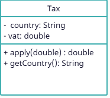

# Chương 4: Vấn đề giá biên và null

## 4.1 Vấn đề về giá trị biên

Sau một thời gian làm trong nghề tôi nhận ra rằng người mới thường quan tâm vào thẳng nghiệp vụ code mà công để ý các tiểu tiết. Tôi cũng đã từng như vậy. Họ không quan tâm đến các giá trị biên và null.

Hãy xem xet việc insert/update vào bảng product trong Database
xem ví dụ dưới đây

```java
    ....
    updateProduct(productKey, productName);
    .....
    private void updateProduct(Long productKey,String productName){
        Product product = new Product();
        product.setProductKey(productKey);
        product.setProductName(productName);
        productDao.updateProductNameByID(product);
    } 
```

Nhìn trên code ta có thể thấy rõ ràng là hàm updateProduct đã yêu cầu đầu vào đã validate productName (max size, min size, format ...).

tuy nhiên đa phần người mới vào nghề thường không validation productName trước khi gọi hàm này. Theo như một số ống lí luận là "**nó sẽ ném ra một exception và tôi sẽ bắt và xử lý nó**". Vâng nó đúng là trả ra một exception. Nhưng nếu khách hàng yêu cầu đưa ra lỗi cụ thể -> khi đó sẽ ra sao? quay về bài toán validate hay là bài toán đọc nó trong exception khó gặp -> và ở đây xác định là quay về bài toán validation :). đôi khi code có thể dài hơn tuy nhiên tính toán đến khả năng mở rộng của nó là điều cực kì quan trọng.

Còn có các vấn đề liên quan đến limit default. tôi sẽ không đề cập ở đây.

## 4.2 vấn đề về null

### Ví dụ 1

```java
    boolean stringeq = productName.equals("Haitv");
```

Đánh giá code nếu dựa vào dòng code trên ta có thể thấy được lỗi tiềm ẩn như sau:\
productName = null thì đoạn code trên sẽ gây lỗi

cách sửa cũng đơn giản thôi hay đổi thứ tự so sánh như code dưới

```java
    boolean stringEq = "Haitv".equals(productName);
```

Như vậy lỗi tiềm ẩn trên đã được giải quyết.

Vậy nếu như đoạn code dưới thì sao

```java
    boolean stringEq = name.equals(productName);
```

Nhận thấy rằng không có cơ sở gì để đảm bảo được biến `name`, `productName` sẽ không mang giá trị `null`

Vậy trong trường hợp này ta sẽ xử lý như thế nào.

Đầu tiên hãy tìm trong common function đã tồn tại code thay thế nó hay chưa. Nếu đã có thì dùng thôi

Nếu trong code common không có hãy kiểm tra xem các thư viện bạn dùng có hỗ trợ hàm này không. ví dụ như common.lang của apache,.. nếu đã có thì lôi chugs ra dùng (phần này có thể sẽ hơi khó đối với những người chưa làm nhiều với thư viện hoặc mới vào nghề).

Trường hợp còn lại, Nên viết hàm này thành code common để dùng cho các lần sau

### Ví dụ 2

```java
    @Autowire
    ProductService productService;
    ...
    List<String> products = productService.getProducts();
    products.forEach(System.out::println);
```

`ProductService` là một interface và nó hoàn toàn bị giấu đi nội dung implement của nó.

Ta sẽ phân tích và đánh giá đoạn code trên như sau:\
Sẽ ra sao nếu `products` = null -> `products.forEach` sẽ gây ra NullpoiterException lỗi rất nhiều người gặp phải. Đây là code có nguy cơ gặp lỗi nếu như không xác định được kết quả trả về của getProducts().

Vậy bạn sẽ làm sao để xử lý với trường hợp này?\
Check null trước khi cho vào foreach?\
Hay hay quy ước rằng những function mà bạn tả vè kiểu Collection thì mặc nhiên không trả null.

**`Hạn chế tối đa việc trả ra null hoặc truyền các tham số là null nếu không thực sự cần thiết`**. \
Tin tôi đi điều này sẽ làm giảm rất nhiều bug phát sinh do null.

## 4.3  đối tượng null

Phần trên là cách đối phó với null để hạn chế lỗi phát sinh với các vấn đề về code với java code. Vậy nếu nhưng class mà ta tạo ra thì sao. Xem sét ví dụ sau:

```java
    Tax tax = getTaxByCountry("USA");

    System.out.println("tax in "+tax.getCountry()+"is: "+tax.apply(30000));
```

Xét ví dụ ở trên ta có thể thấy được là hàm `getTaxByCountry` lấy ra đối tượng tax với params là mã quốc gia. vâng thật may mắn là tham số `"USA"` là mã của quốc gia thật. và nó không phát sinh lỗi. Vậy thử hình dung tham số truyền vào không phải là mã của một quốc gia, ví dụ như "NOT_COUNTRY" chẳng hạn. Vậy khi đó hàm trả ra gì bắn 1 exeption hay trả ra null? như vậy chúng ta có 2 hướng giả quyết như sau:

 1. Trả null và kiểm tra null ngay sau kết quả trả về.
 2. Trả exception và bắt và xử lý exception khi câu lệnh được gọi.

Bạn sẽ chọn giải pháp nào ?\
Xét cho cùng thì nếu bạn chọn giải pháp nào thì nó cũng có mức ảnh hưởng nhất định. Tôi giả sử  như sau : hàm `getTaxByCountry` được gọi ở nhiều nơi cứ lấy tạm là 100 lần đi. như vậy bạn sẽ phải check null hoặc bắt và xử lý nó 100 lần trước khi sử dụng. Waoooo. Toang thât rồi. và biết đâu bạn lại sẽ copy nó từ một chỗ nào đó đã được viết trước thì sao -> có thể dẫn đến lỗi copy mà tôi đã đề cập trong chương trước.

Vâng nó có 1 giả pháp khác: Null Object Design Pattern.

Tôi sẽ trình bày nó ngay dưới đây
Vậy ta sẽ lấy ngay chính ví dụ về thuế.

Xem xet sơ đồ UML hiện tại của Tax



Nếu class tax được làm như sơ đồ trên thì nó sẽ gặp phải vấn đề trên theo đúng những gì mà ta đã đề cập ở trên.

Vậy ta sẽ áp dụng Null Object Design Pattern.

đàu tiên trừu tượng hóa lớp Tax hiện tại thành interface Class như sau

```java
    public interface Tax {
        String getCountry();
        double apply(double price);
    }
```

Tiếp đó là implement của nó

```java
    public class RealTax implements Tax {
        private String country;
        private double vat;
 
        public RealTax(String country, double vat) {
            this.country = country;
            this.vat = vat;
        }
    
        @Override
        public String getCountry() {
            return country;
        }
    
        @Override
        public double apply(double price) {
            return price * vat/100;
        }
    }
```

Và thêm một đối tượng null cũng implement từ Tax được cài đặt như sau

```java
    public class NullTax implements Tax {
 
        private String country = "UNKNOWN_COUNTRY";
    
        public NullTax(String country) {
            if (country != null) {
                this.country = country;
            }
        }
    
        @Override
        public String getCountry() {
            return country;
        }
    
        @Override
        public double apply(double price) {
            return price * 1;
        }
    }
```

Vậy là ta đã có đối tượng null

Tiếp đó tạo factory cho chúng cài đặt như dưới.

```java
    public class TaxFactory {
 
        private static final Map<String, Double> VATS = new HashMap<>();
    
        static {
            VATS.put("JP", 5);
            VATS.put("USA", 5);
            VATS.put("VN", 0);
        }
    
        public static Tax getTaxByCountry(String country) {
            Double vat = VATS.get(country);
            if (vat != null) {
                return new RealTax(country, vat);
            }
            return new NullTax(country);
        }
    }
```

Đoạn code ban đầu được sửa lại như sau

```java
    Tax tax = TaxFactory.getTaxByCountry("USA");

    System.out.println("tax in "+tax.getCountry()+"is: "+tax.apply(30000));
```

Như vây khi khởi tạo xong tax ta sẽ không bao giờ cần phải quan tâm đến null vì nó chẳng bao giờ xảy ra.

Vậy ta đánh giá design pattern này:

1. `Lợi ích của Null Object Pattern`
    * Code trở nên đơn giản hơn, giảm bớt các điều kiện kiểm tra.
    * Giảm khả năng xảy ra lỗi Null Pointer Exception.
2. `Nhược điểm của Null Object Pattern`
    * Ta không thể bắt được các lỗi cụ thể kia, khó truy vết được lỗi
3. `Sử dụng Null Object Pattern khi nào?`
    * Đối phó với các đối tượng null.
    * Thay vì kiểm tra đối tượng null, chúng ta xác định hành vi null hoặc hành vi được gọi nhưng không làm gì.
    * Cung cấp hành vi, giá trị mặc định trong trường hợp dữ liệu không có sẵn.
    * Tạo các đối tượng để thử nghiệm, trong trường hợp tài nguyên thật không có sẵn.

## 4.4 Tổng kết

Trong chương này ta cần lưu ý một só vấn đề về biên cũng như một số vấn đề về null như sau:

1. Hãy xử lý biên và luôn quan tâm đến việc có khả năng mở rộng nó sau này.
2. Hạn chế tối đa việc trả ra null hoặc truyền các tham số là null nếu không thực sự cần thiết.

**`NẾU THỰC SỰ CÓ THỂ HÃY ÁP DỤNG Null Object Pattern`**
