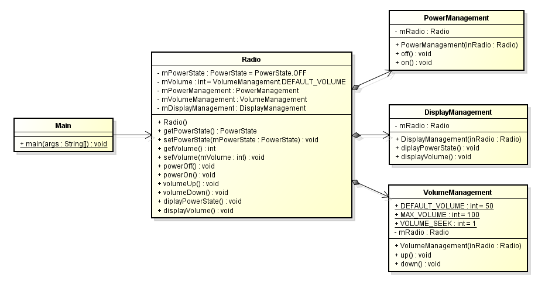

# SINGLE RESPONSIBILITY PRINCIPLE (SRP)

Đây là nguyên lý đầu tiên trong 5 nguyên lý của thiết kế hướng đối tượng SOLID.

**SRP đề cập đến việc một lớp chỉ nên đảm trách duy nhất một nhiệm vụ, chức năng duy nhất**.

Nếu chúng ta gom nhiều chức năng cho một lớp, thì khi chúng ta thay đổi một chức năng nào đó, thì toàn bộ lớp đó phải thay đổi. Và khi có nhiều thay đổi, điều đó cũng có nghĩa là sẽ phát sinh ra nhiều vấn đề khác như lỗi, buộc ta phải test lại hết toàn bộ lớp đó. Hãy tưởng tượng bạn có 1 lớp khoảng 1000 dòng code đã viết cách đây 5 năm, không nảy sinh vấn đề gì vì bạn đã bỏ công ra để test rất kỹ, một ngày đẹp trời nào đó, bạn vào thay đổi, nâng 1 phần nào đó trong lớp, làm sao để bạn đảm bảo là các thành phần khác trong lớp không bị ảnh hưởng? Do vậy bạn phải lại một lần nữa test lại toàn bộ lớp đó.

Chúng ta lấy ví dụ để dễ hiểu

Chúng ta có 1 lớp Radio có thể thực hiện các chức năng như: bật, tắt, volume lớn nhỏ

```java
public class Radio {
 
    public enum PowerState {
        ON,
        OFF
    }
 
    public static final int DEFAULT_VOLUME = 50;
    public static final int MAX_VOLUME = 100;
    public static final int VOLUME_SEEK = 1;
 
    private PowerState mPowerState = PowerState.OFF;

    private int mVolume = DEFAULT_VOLUME;
 
    public PowerState getPowerState() {
        return mPowerState;
    }
 

    public void setPowerState(PowerState mPowerState) {
        this.mPowerState = mPowerState;
    }

    public int getVolume() {
        return mVolume;
    }

    public void setVolume(int mVolume) {
        this.mVolume = mVolume;
    }

    public void powerOff() {
        if(mPowerState == PowerState.ON) {
            mPowerState = PowerState.OFF;
        }
    }
 
    public void powerOn() {
        if(mPowerState == PowerState.OFF) {
            mPowerState = PowerState.ON;
        }
    }

    public void volumeUp() {
        if(mVolume < MAX_VOLUME) { 
            mVolume += VOLUME_SEEK;         
        }   
    }     
    
    public void volumeDown() {
        if(mVolume > 0) {
            mVolume -= VOLUME_SEEK;
        }
    }
 
    public void diplayPowerState() {
        if(mPowerState == PowerState.OFF) {
            System.out.println("Radio has been powered off");
        }
        else if(mPowerState == PowerState.ON) {
            System.out.println("Radio has been powered on");
        }
    }
 
    public void displayVolume() {
        if(mPowerState == PowerState.ON) {
            System.out.println("Volume: " + mVolume);
        }
    }
}

public class Main {
 
    public static void main(String[] args) {
        Radio radio = new Radio();
        radio.diplayPowerState();
        radio.displayVolume();
        radio.powerOn();
        radio.volumeUp();
        radio.diplayPowerState();
        radio.displayVolume();
    }
 
}
```

Kết quả:\
**Radio has been powered off\
Radio has been powered on\
Volume: 51**

OK, mọi thứ vẫn chạy ổn. Bây giờ hãy hình dung, nếu các bạn muốn thay đổi việc xử lý của các hàm power ON/OFF hoặc Volume UP/DOWN? Rõ ràng là các bạn phải chạy vào class này để sửa chúng. Và các bạn thấy đấy, nếu các bạn chỉ muốn thay đổi hàm volumeDown(), các sẽ phải ít nhiều dè chừng đến các hàm khác, xem có bị ảnh hưởng hay không.

Chúng ta đã vi phạm nguyên lý Single Responsibility. Để giải quyết chuyện này, hãy nhớ đến nguyên lý Single Responsibility cho mỗi class, chúng ta thấy class Radio hiện tại có đến 3 chức năng: bật tắt nguồn, to nhỏ volume và hiển thị trạng thái của Radio. Cho nên chúng ta có thể tách các chức năng đó ra riêng biệt để khi sửa đổi, chúng ta có thể thu hẹp lại phạm vi cần sửa đổi. Trước khi xem code mẫu, các bạn hãy tự suy nghĩ xem là phải làm gì nhé.

```java
public class Radio {
 
    private PowerState mPowerState = PowerState.OFF;
 
    private int mVolume = VolumeManagement.DEFAULT_VOLUME;
 
    private PowerManagement mPowerManagement;
    private VolumeManagement mVolumeManagement;
    private DisplayManagement mDisplayManagement;
 
    public Radio() {
        mPowerManagement = new PowerManagement(this);
        mVolumeManagement = new VolumeManagement(this);
        mDisplayManagement = new DisplayManagement(this);
    }

    public PowerState getPowerState() {
        return mPowerState;
    }

    public void setPowerState(PowerState mPowerState) {
        this.mPowerState = mPowerState;
    }

    public int getVolume() {
        return mVolume;
    }

    public void setVolume(int mVolume) {
        this.mVolume = mVolume;
    }

    public void powerOff() {
        mPowerManagement.off();
    }

    public void powerOn() {
        mPowerManagement.on();
    }

    public void volumeUp() {
        mVolumeManagement.up();
    }

    public void volumeDown() {
        mVolumeManagement.down();
    }

    public void diplayPowerState() {
        mDisplayManagement.diplayPowerState();
    }
 
    public void displayVolume() {
        mDisplayManagement.displayVolume();
    }
}

public class PowerManagement {
 
    public enum PowerState {
        ON,
        OFF
    }

    private Radio mRadio;

    public PowerManagement(Radio inRadio) {
        mRadio = inRadio;
    }

    public void off() {
        if(mRadio != null && mRadio.getPowerState() == PowerState.ON) {
            mRadio.setPowerState(PowerState.OFF);
        }
    }
 

    public void on() {
        if(mRadio != null && mRadio.getPowerState() == PowerState.OFF) {
            mRadio.setPowerState(PowerState.ON);
        }
    }
}

public class VolumeManagement {
 
    public static final int DEFAULT_VOLUME = 50;
    public static final int MAX_VOLUME = 100;
    public static final int VOLUME_SEEK = 1;

    private Radio mRadio;

    public VolumeManagement(Radio inRadio) {
        mRadio = inRadio;
    }
 
    public void up() {
        if(mRadio != null) {
            int volume = mRadio.getVolume();
            if(volume < MAX_VOLUME){ 
                mRadio.setVolume(volume + VOLUME_SEEK);
            }       
        }   
    }
    
    public void down() {
        if(mRadio != null) {
            int volume = mRadio.getVolume();            if(volume > 0) {
                mRadio.setVolume(volume - VOLUME_SEEK);
            }
        }
    }
}

public class DisplayManagement {

    private Radio mRadio;

    public DisplayManagement(Radio inRadio) {
        mRadio = inRadio;
    }

    public void diplayPowerState() {
        if(mRadio != null) {
            if(mRadio.getPowerState() == PowerState.OFF) {
                System.out.println("Radio has been powered off");
            }
            else if(mRadio.getPowerState() == PowerState.ON) {
                System.out.println("Radio has been powered on");
            }
        }
    }

    public void displayVolume() {
        if(mRadio != null &amp;amp;amp;&amp;amp;amp; mRadio.getPowerState() == PowerState.ON) {
            System.out.println("Volume: " + mRadio.getVolume());
        }
    }
}

public class Main {
    public static void main(String[] args) {
        Radio radio = new Radio();
        radio.diplayPowerState();
        radio.displayVolume();
        radio.powerOn();
        radio.volumeUp();
        radio.diplayPowerState();
        radio.displayVolume();
    }
}
```

Kết quả:\
**Radio has been powered off\
Radio has been powered on\
Volume: 51**

Class Diagram:



Kết quả không có gì thay đổi, nhưng code đã thay đổi rất nhiều (có thêm 3 lớp mới). Các bạn có thể thắc mắc, để 1 lớp Radio như vậy thôi, có gì vào đó sửa cho nhanh, việc gì phải tách ra làm cho code thêm nhiều? Nhưng các bạn thử nghĩ, nếu sau này lớp Radio nó lên tới hàng ngàn dòng code, hàng trăm function chỉ xoay quanh các việc: bật tắt nguồn, to nhỏ volume hoặc display thông tin hoặc nhiều hơn. Bạn có thể phải thay đổi một vài function trong đám hỗn độn đó. Thay vì bạn chỉ phải vào 1 lớp cụ thể nào đó để sửa và test lại lớp đó nếu bạn tách các chức năng khác nhau ra những lớp khác nhau.
