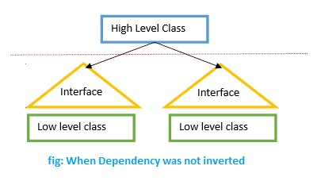
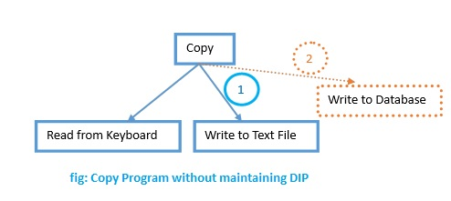
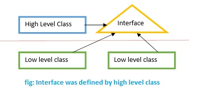
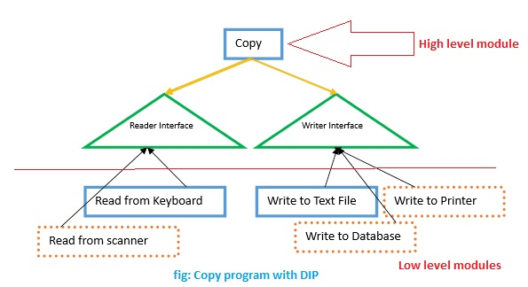

# THE DEPENDENCY INVERSION PRINCIPLE (DIP)

**Nguyên lý này chỉ ra rằng các lớp high-level không được phụ thuộc vào các lớp low-level. Thay vì để các lớp high-level sẽ sử dụng các interface do các lớp low-level định nghĩa và thực thi, thì nguyên lý này chỉ ra rằng các lớp high-level sẽ định nghĩa ra các interface, sau đó các lớp low-level sẽ thực thi các interface đó.**

HÃY XEM VÍ DỤ DƯỚI ĐÂY:

Design ko áp dụng nguyên lý DIP: các lớp cấp cao phải phụ thuộc vào các interface của lớp cấp thấp

Với kiểu design như vậy, thì các lớp cấp cao phải biết tất cả các interface của các lớp con. Khi có thêm một lớp cấp thấp thêm vào, chúng ta phải tiến hành thay đổi trong lớp cấp cao để nó có thể hiểu được các interface của lớp mới thêm vào. Điều này gây ra rất nhiều khó khăn trong việc chỉnh sửa. bảo trì và kiểm thử, nó vi phạm nguyên lý Open Close Principle.

Ví dụ cụ thể: dưới đây là mô hình của chương trình Copy program mà không sử dụng DIP:

Tạm thời bỏ qua phần màu cam đứt quãng. Có thể thấy chương trình trên nhận các input từ bàn phím, và sẽ ghi ra 1 file text. Chương trình hiện tại có thể làm việc OK. Sau đó 1 khoảng thời gian, có 1 yêu cầu mới yêu cầu bạn support chương trình Copy này sao cho nó có thể ghi ra database, vậy là bạn phải thay đổi code trong Copy program để nó có thể làm việc ghi ra database. Điều này gây ra rất nhiều khó khăn trong việc chỉnh sửa. bảo trì và kiểm thử, nó vi phạm nguyên lý Open Close Principle. (Mình vừa lặp lại câu trên, điều này cũng vi phạm 1 nguyên lý trong thiết kế hướng đối tượng, và mình sẽ bàn trong dịp khác)

Trường hợp áp dụng DIP:

thay vì để các lớp cấp cao phải phụ thuộc vào các lớp cấp thấp, ta sẽ đặt các interface ở lớp cấp cao, và buộc các lớp con phải định nghĩa lại.

Như vậy các lớp ở level cao sẽ không còn phải phụ thuộc vào các lớp thấp nữa, nó chỉ cần biết và thực thi duy nhất interface mà nó đã tạo ra. Mỗi khi thêm mới 1 lớp cấp thấp vào, lớp đó phải tuân theo và thực thi interface mà lớp cấp cao đã định nghĩa.

Ví dụ cụ thể: dưới đây là mô hình của chương trình Copy program áp dụng DIP:

Như ta đã thấy, bây giờ Copy program chỉ còn phụ thuộc vào 2 interface duy nhất: Reader và Writer do chính nó định nghĩa. Ở dưới là các lớp low-level, chúng ta có thể có nhiều lớp để thực hiện việc đọc, ghi, và điểm chung giữa chúng là sẽ phải thực thi một trong 2 interface mà Copy program đã định nghĩa. Khi có 1 lớp đọc hoặc ghi được thêm vào, muốn cho lớp trên nó hiểu, điều đơn giản chúng ta làm là để cho lớp đó thực thi interface mà lớp trên nó đã đưa ra, như vậy sẽ đảm bảo việc chúng ta sẽ không phải thay đổi gì cả ở lớp trên.

Tuy nhiên, các nguyên lý này chỉ mới chỉ ra cho chúng ta biết, thiết kế nào là đúng, thiết kế nào là sai chứ chưa giúp chúng ta giải quyết được vấn đề. Trong khi làm thực tế, gặp phải những vấn đề cụ thể như: làm thế nào để giảm thiểu số lượng các đối tượng phải tạo ra trong chương trình, làm thế nào để tích hợp một module có sẵn vào trong hệ thống của mình… Tất cả những chuyện như vậy sẽ được giải quyết bằng cách áp dụng các "Mẫu thiết kế" (Design Pattern). Nói đơn giản hơn, các mẫu thiết kế sẽ giúp chúng ta giải quyết những bài toán thường gặp trong những ngữ cảnh nhất định. Các mẫu thiết kế cũng tuân theo các nguyên lý thiết kế hướng đối tượng làm cơ sở. Vì vậy việc nắm vững các nguyên lý này là điều cần thiết nếu các bạn muốn tiến sâu hơn trong việc tạo ra 1 sản phẩm có kiến trúc đẹp, chất lượng.
