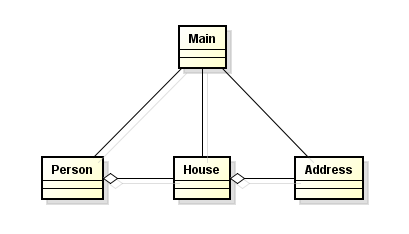
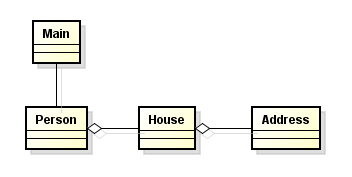

# THE LAW OF DEMETER PRINCIPLE (LoD)

**Nguyên lý này chỉ ra rằng các đối tượng chỉ nên biết những đối tượng nó cần biết phải biết.**

Xét ví dụ sau:

```java
public class Main {
 
    public static void main(String[] args) {
        Address address = new Address();
        address.setName("01");
        address.setZipCode("000001");
 
        House house = new House();
        house.setAddress(address);
 
        Person person = new Person();
        person.setHouse(house);
 
        // Print the person zip code
        System.out.println(person.getHouse().getAddress().getZipCode());
    }
}
```

Đoạn code trên nhìn không có vấn đề gì. Hãy nhìn lại nguyên lý Law of Demeter. Lớp Main muốn in ra ZipCode của 1 người nào đó nhưng nó lại phải “quan tâm” đến nhiều lớp khác như: House, Address. Có thể nó có 1 sự “tight coupling” không nhẹ ở đây. Để in ra ZipCode, Main phải get House của người đó, sau đó lại get ra địa chỉ của House và cuối cùng là get ra ZipCode từ address.

Bây giờ là phần của “The Change”. Không lâu sau đó, Boss của bạn muốn bỏ đi lớp Address, thay vào đó lớp House sẽ giữ ZipCode. Với đoạn chương trình hiện tại của chúng ta thì điều đó chẳng có nghĩa lý gì. Nhưng hãy nghĩ đến những cái hố đen hơn nếu như đoạn in ra ZipCode ở trên xuất hiện ở hàng trăm nơi trong chương trình thực sự của bạn, bạn có đủ can đảm để thay đổi hết chúng, và sau đó… test lại..

Giải phái cho nó như sau

```java
public class Person {
    private House house;
 
    public void setHouse(House house) {
        this.house = house;
    }
 
    public House getHouse() {
        return house;
    }
 
    public String getZipCode() {
        return house.getZipCode();
    }
}

public class House {
    private Address address;
 
    public void setAddress(Address address) {
        this.address = address;
    }
 
    public Address getAddress() {
        return address;
    }
 
    public String getZipCode() {
        return address.getZipCode();
    }
}

public class Address {
    private String name;
    private String zipCode;
 
    public void setName(String name) {
        this.name = name;
    }
 
    public void setZipCode(String zipCode) {
        this.zipCode = zipCode;
    }
 
    public String getName() {
        return name;
    }
 
    public String getZipCode() {
        return zipCode;
    }
}

public class Main {
 
    public static void main(String[] args) {
        Address address = new Address();
        address.setName("01");
        address.setZipCode("000001");
 
        House house = new House();
        house.setAddress(address);
 
        Person person = new Person();
        person.setHouse(house);
 
        // Print the person zip code
        System.out.println(person.getZipCode());
    }
 
}
```

Bây giờ, khi sếp muốn remove lớp Address ra khỏi hệ thống, việc đơn giản là move ZipCode qua House và delete lớp Address, những phần khác đều không phải “lo”.

CLASS DIAGRAM:

diagram vi phạm DEMETER


diagram tuân thủ DEMETER


**Đó là lợi điểm của LoD, nó giúp hệ thống của chúng ta đứng vững trước những thay đổi bằng cách giảm coupling hay còn gọi là cách design loose coupling, mọi sự thay đổi sẽ là nhỏ nhất nếu có thể.**

**Nhìn thì có vẻ mọi thứ rất đơn giản. Nhưng nếu chúng ta vi phạm những điều rất đơn giản này, nó sẽ kéo theo việc vi phạm những thứ phức tạp hơn. Vì những điều phức tạp đều được xây dựng từ những điều đơn giản nhất như ở trên.**
