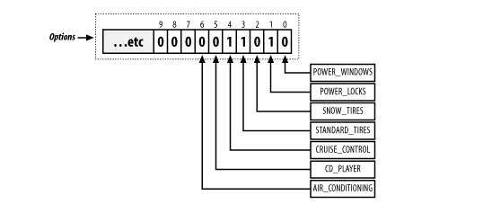

# Chương 16 Bàn luận về Constant

Có vẻ như từ khóa final đã viết về constant? và đa phần mọi người nghĩ nó là đơn giản và coi nó là đương nhiên. Tuy nhiên, các hằng số không được sử dụng đúng cách có thể là nguyên nhân chính gây ra các cơn đau đầu về phát triển.

Mặc dù hầu hết các nhà phát triển coi hằng số là một khái niệm duy nhất, nhưng thực tế có ba loại hằng số: thay thế (substitution), trường bit (bit field) và tùy chọn (option). Mỗi danh mục này có các động lực khác nhau và các vấn đề khác nhau cần giải quyết.

## 16.1 substitution - Thay thế

Hằng số thay thế là loại hằng số đơn giản nhất. Về cơ bản, chúng được thay thế cho một thứ khác trong mã.

vị trí của hằng số được đặt chỉ có tác dụng trong phạm vi của nó. ví dụ hằng số private được khai báo như một phương thức trong 1 lớp thì nó chỉ có tác dụng trong chính lớp này. và nếu như bạn khai báo hằng trong phuong thức thì nó chỉ có tác dụng trong chỉ phương thức và không có tác dụng trong lớp chứa phương thức.

Mặc dù chúng có vẻ tầm thường, nhưng bạn cần phải xem xét các hằng số thay thế khi thiết kế mã của mình. Chúng có thể biến mã lộn xộn, khó đọc thành mã dễ hiểu.

nói chung phần này khá nhẹ nhàng và bạn dễ dàng để có thể can thiệp vào hệ thống này
tôi đưa thêm một ví dụ về I18n lấy theo ngôn ngũ.

```java
public final class I18N2 {

  public static final String OK;
  public static final String CANCEL;
  public static final String REFRESH;

  static {
    final String BUNDLE_NAME = "oreilly/hcj/constants/I18N";
    final ResourceBundle BUNDLE = ResourceBundle.getBundle(BUNDLE_NAME);

    OK = getString(BUNDLE, "OK");
    CANCEL = getString(BUNDLE, "CANCEL");
    REFRESH = getString(BUNDLE, "REFRESH");
  }

  private I18N2() {
  }

  private static String getString(final ResourceBundle bundle, final String key) {
    try {
      return bundle.getString(key);
    } catch (final MissingResourceException ex) {
      assert (false) : ex.getMessage( );
      return '!' + key + '!';
    }
  }
}
```

Tất nhiên code trên là chưa hoàn toàn đủ. tôi chỉ nhấn mạnh về mặt ý tưởng rằng bạn có thể nạp nó bằng cahcs đọc trong khối `static {}` nó à hàm tự khởi chạy giống kiểu `postcontructor` . hãy nạp các file đa ngôn ngữ này vào trong một biến final. tin tôi đi chỉ cần nạp 1 lần hệ thống sẽ dùng các biến này thường xuyên và tốc độ của nó sẽ rất nhanh.

## 16.2 Bit Fields

đây là một phậm trù khá hay ho. tôi giả sử bạn có một bài toán như này. bạn xây dựng một lớp Car và nó có một base có sẵn và thêm nhiều lựa chọn mở rộng. vậy bạn sẽ quản lý các oprion đó ra sao tạo ra một list rồi đẩy các option theo thứ tự vào trong list đó, hya tạo ra một string rồi cộng dần cá lựa chọn. và tất nhiên là có một cách tốt hơn như thế là Bit Fields

Xem ví dụ dưới đây:

```java
public class Car {
  public final static int POWER_WINDOWS = 1;
  public final static int POWER_LOCKS = 2;
  public final static int SNOW_TIRES = 4;
  public final static int STANDARD_TIRES = 8;
  public final static int CRUISE_CONTROL = 16;
  public final static int CD_PLAYER = 32;
  public final static int AIR_CONDITIONING = 64;

  private int options;

  public Car( ) {
  }

  public void setOptions(final int options) {
    this.options = options;
  }

  public int getOptions( ) {
    return this.options;
  }
}
```

Nhìn ví dụ này xong chắc bạn cũng chưa hiểu gì. Tôi sẽ gợi ý thêm 1 chút nhìn các con số option 1, 2, 4, 8 ... .Ồ nó là của lỹ thừa cơ số 2 của x với x là vị trí của bit tồn tại và để cho dễ hình dung tôi đưa thêm hình ảnh để cho các bạn dễ mường tượng ra ý tưởng hay ho của nó.



dựa trên ảnh trên chỉ cẩn có 1 chút hiểu biết về lưu trữ bit cũng có thể hiểu được cách thức của nó.

ở đây có nhiều người vẫn hỏi khi input rõ ràng là kiểu int vậy tôi phải cộng các option lại à và khi tôi check các options kia tôi làm sao để tách. Nếu bạn đã từng học toán logic thì đây là câu hỏi khá ngu ngốc? à mà thôi tôi sẽ bổ túc cho bạn đôi điều kiến thức há hay ho về AND về về OR mà bạn đã từng học mà hoàn toàn chả nhớ j về nó

### 16.2.1 AND

toán tử AND vâng chắc bạn bảo nó chả có j nhỉ. Vâng đúng là nó chả có j cho đến khi bạn nhìn vào điều phi thường mà nó có thể làm được dưới bit. Vâng ở đây tôi gọi đó là điều phi thường.

với toán tử AND `chỉ 1 and 1 = 1 còn lại = 0 (1 and 0, 0 and 1, 0 and 0)`(áp nó trên bit ta có thể hình dung được 2 hệ quả phía dưới)

- Reset một dãy bit vâng bạn ko nghe nhầm đâu nếu tôi And options với 0 thì nó sẽ xóa sạch sẽ mọi bit option. ta có thể sùng điều này cho việc reset options nếu cần và tuy nhiên có 1 cahs khác là hãy gán nó bằng 0 . :D
- Reset chỉ giữ lại bit ở vị trí chỉ định . ví vụ tôi muốn giữ lại bit thứ 4 của một dãy bit như sau: 01010000111101010101\
vậy tôi sẽ And nó với 2^(4-1) = 8 (dec)  = 0001 (bit)\
kết quả sẽ là:\
01010000111101010101 and 0001 =\
0001 > 0\
Nếu option ban đầu ví trí thứ 4 là 0 thì sao\
01000000111101010101 and 0001 =\
00000000000000000000 = 0

từ 2 điều phi thường này sẽ đưa cho ta cách đẻ biết được option có được chọn hay ko trong Car trên.

### 16.2.2 OR

Toán từ OR chỉ sai khi cả 2 đề sai. trong bit bạn có thể hiểu nó như thế này. `Chỉ 1 OR 0 = 0 còn lại =1 (1 or 1, 1 or 0, 0 or 1)`

Tôi lấy ví dụ việc bạn thêm các option lựa chọn vào . tôi chỉ lấy ví dụ 8 bit

option: 10010000 or 00100000 = 10110000  (9 or 4 = 13)

Đến đây nhiều người lầm tưởng răng nó giống phép cộng , thực chất nó không phải phép cộng. 10110000 or 00100000 = 10110000 (13 or 4 = 13)

:D.

Ở đây tôi nói thêm 1 điều nữa các bạn tin hay không thì tùy. máy tính làm việc trên bit do vậy `tính toán nhanh nhất là tính toán trên bit`,các hệ thuật toán yêu cầu về mặt hiệu năng đều dính dáng đến các toán tử OR, AND. Tuy nhiên nó có 1 vấn đề là `nó thực sự khó hiểu và đôi khi code rất tối nghĩa nó sẽ rất khó bảo trì nếu không phải là người viết ra nó tiến hành bảo trì`. tuy nhiên ở đây tôi nhấn mạnh một lần nữa : **`Đôi khi bạn phải đánh đổi code sạch và hiệu năng, về lâu dài sẽ có những trường hợp bắt buộc bạn phải đặt lên bàn cân giữa 2 code perform và clean code`**

### 16.2.3 sử dụng Bit Fields

kết thức 2 phần nhỏ về and và or tôi sẽ nói tieps đến cách sử dụng Bit Fields:

nhập vào options các lựa chọn :

```java
public void setBitFields( ) {
    this.myCar = new Car( );
    myCar.setOptions(Car.CRUISE_CONTROL | Car.STANDARD_TIRES | Car.POWER_LOCKS);
    System.out.println(myCar.getOptions( ));
  }
```

check oprion thì như sau :

```java
public void printCarOptions( ) {

    System.out.println("-- Options --");
    if ((myCar.getOptions( ) & Car.POWER_WINDOWS) > 0) {
      System.out.println("Power Windows");
    }

    if ((myCar.getOptions( ) & Car.POWER_LOCKS) > 0) {
      System.out.println("Power Locks");
    }

  }
```

Bit Fields rất chi là hay, tuy nhiên nó có những vấn đề mà bạn nên biết:

1. Vấn đề về khẳ năng mở rộng như bạn đã biết thì nó có giới hạn là 32 bit vậy nếu như lựa chọn vượt qua 32 thì kaka bạn sẽ phải tái cáu trúc lại và ôi thôi nó ko đơn giản như bạn nghĩ
2. Nó vi phạp tính đocngs gói trong lập trình hướng đối tượng - cái mà tôi bảo đánh dổi giữa hiệu suất  và code sạch là ở đây
3. Bit Fields quá khó hiểu và không được sử dụng nhiều trong các ứng dụng Java. Thời gian duy nhất bạn nên sử dụng chúng là khi bạn thực sự không còn lựa chọn nào khác. Tuy nhiên, chúng là thứ mà bạn sẽ phải xử lý thường xuyên trong mã kế thừa. Bất cứ khi nào bạn có cơ hội chuyển đổi chúng thành hằng số tùy chọn, tôi thực sự khuyên bạn nên làm như vậy.

## 16.3 Option Constants

Option Constants thường có sự tương đồng nổi bật với Bit Fields. Tuy nhiên, sự khác biệt chính giữa chúng là một Bit Field sử dụng lũy thừa của hai cho các hằng số liên tiếp, trong khi Option Constants thường được đánh số theo thứ tự và sử dụng các kết hợp không có ý nghĩa đối với một Bit Fields

Xem ví dụ dưới:

```java
public class Country {
  public static final int CANADA = 0;
  public static final int CROATIA = 1;
  public static final int GERMANY = 2;
  public static final int ITALY = 3;
  public static final int MEXICO = 4;
  public static final int UK = 5;
  public static final int USA = 6;
}
```

Và tất nhiên việc cài dặt nó như thế này

```java
public class Address {
  private int country;

  public void setCountry(final int country) {
    this.country = country;
  }

  public int getCountry( ) {
    return this.country;
  }
}
```

Có một lỗ hổng ở đây. nếu counttry không nằm trong đoạn từ 0 đến 6 thì sao. như vậy ta lại thêm 2 hằng số min và max nữa nhìn nó như thế này

```java
public class Country {

  public static final int CANADA = 0;
  public static final int CROATIA = 1;
  public static final int GERMANY = 2;
  public static final int ITALY = 3;
  public static final int MEXICO = 4;
  public static final int UK = 5;
  public static final int USA = 6;

  public static final int MIN_VALUE = 0;
  public static final int MAX_VALUE = 6;

}

public class Address {

  public void setCountry2(final int country) {

    if ((country < Country.MIN_VALUE) || (country > Country.MAX_VALUE)) {
      throw new IllegalArgumentException( );
    }
    this.country = country;
  }
}
```

Giờ bạn lại muốn thêm một quốc gia nữa và vô ý bạn chỉ thêm và không tăng giá trị của MAX_VALUE nó sẽ như thế này.

```java
public class Country {

  public static final int CANADA = 0;
  public static final int CROATIA = 1;
  public static final int GERMANY = 2;
  public static final int ITALY = 3;
  public static final int MEXICO = 4;
  public static final int UK = 5;
  public static final int USA = 6;
  public static final int VENEZUELA = 7;

  public static final int MIN_VALUE = 0;
  public static final int MAX_VALUE = 6;

}

public class Address {

  public void setCountry2(final int country) {

    if ((country < Country.MIN_VALUE) || (country > Country.MAX_VALUE)) {
      throw new IllegalArgumentException( );
    }
    this.country = country;
  }
}
```

Bạn có thể ko phát hiện lỗi này nhưng sẽ phát hiện khi hệ thống được triển khai. Tôi chưa kể đến trường hợp lỗi nhầm 2 quốc gia có cùng một mã số.

Tuy nhiên tôi không thực sự hài long lắm với nó bởi tôi quan điểm rõ ràng việc mở rộng chỉ ảnh hưởng đến một phần nhỏ. và ở đây có vẻ như ảnh hưởng đến ít nhất 2 khía cạnh chưa kể nếu các giá trị đó không còn là các giá trị nguyên liên tục thì các giá trị min max kia lập tức trở thành rác.

Do đó có một khái niệm mới ra đời thay cho khái niệm cổ xưa này: constant objects

## 16.4 Constant Objects

Như phần trước tôi đã từng nói rằng bạn có thể làm bất cứ điều gì để phân biệt Options constant. Các đối tượng không đổi sử dụng các trường hợp cuối cùng của các lớp cuối cùng để khai báo hằng số và phân biệt chúng. Mỗi hằng số là một đối tượng là một thể hiện của lớp hằng số. Lớp đối tượng không đổi nhóm các tùy chọn với nhau theo chủ đề.

Xét ví dụ dưới:

```java
package testprj.omg;

public final class NetAppException2 extends Exception {

    public static final NetAppException2 NETWORK_UNDEFINED = new NetAppException2("NETWORK_UNDEFINED");

    public static final NetAppException2 NETWORK_SEVER_RESET = new NetAppException2("NETWORK_SEVER_RESET");

    public static final NetAppException2 NETWORK_INVALID_HOST_NAME = new NetAppException2("NETWORK_INVALID_HOST_NAME");

    public static final NetAppException2 LOGIC_BAD_PARAMETER = new NetAppException2("LOGIC_BAD_PARAMETER");

    public static final NetAppException2 LOGIC_AUTHORIZATION_FAILED = new NetAppException2(
            "LOGIC_AUTHORIZATION_FAILED");

    private final String name;

    private NetAppException2( final String name ) {
        this.name = name;
    }

    public String getName() {
        return this.name;
    }
}
```

Trong mã này, các hằng số được xác định không phải bởi số nguyên mà bởi các đối tượng. Mỗi hằng số được khởi tạo trong quá trình khởi tạo tĩnh với một cuộc gọi đến hàm xây dựng riêng và chuyển tên của nó cho constructor để lưu trữ trong một biến chỉ đọc.

Kỹ thuật này giúp bạn tiết kiệm hàng trăm dòng mã. Để chứng minh, chúng ta hãy xem lại các lớp Quốc gia và Địa chỉ. Đầu tiên, chuyển đổi lớp `Country` thành mô hình đối tượng không đổi.

```java
public class Country2 {

    public static final Country2 CANADA = new Country2("CANADA");
    public static final Country2 CROATIA = new Country2("CROATIA");
    public static final Country2 GERMANY = new Country2("GERMANY");
    public static final Country2 ITALY = new Country2("ITALY");
    public static final Country2 MEXICO = new Country2("MEXICO");
    public static final Country2 UK = new Country2("UK ");
    public static final Country2 USA = new Country2("USA");
    public static final Country2 VENEZUELA = new Country2("VENEZUELA");

    private final String name;

    private Country2( final String name ) {
        this.name = name;
    }

    public String getName() {
        return this.name;
    }

}
```

Bây giờ bạn đã có một lớp `Country` sửa đổi, đã đến lúc xem lại các vấn đề được thảo luận trước đó. Hãy bắt đầu với setter không được đánh dấu.

```Java
public class Address2 {

    private Country2 country;

    public void setCountry( final Country2 country ) {
        this.country = country;
    }
}
```

Vì trình setter mới lấy một đối tượng kiểu Country2, người dùng không thể chuyển cho bạn bất cứ thứ gì ngoại trừ một đối tượng Country2. Hơn nữa, vì phương thức khởi tạo của Country2 là riêng tư, người dùng không thể tạo một đối tượng Country2 mới. Hoàn toàn không cần xác thực `Country` ở đây hoặc bất kỳ nơi nào khác trong code! Người dùng của lớp không còn phải thực hiện bất kỳ xác nhận nào; nguyên tắc kỹ thuật hướng đối tượng vẫn còn nguyên vẹn. Nếu điều đó không đủ để bán cho bạn khái niệm về các đối tượng không đổi, thì vẫn còn nhiều lợi ích hơn.

Vì các quốc gia của bạn được khai báo là các đối tượng và không cần phải sắp xếp theo thứ tự, bạn có thể khai báo chúng theo bất kỳ thứ tự nào bạn muốn. Bạn có thể sắp xếp chúng theo thứ tự bảng chữ cái, sắp xếp chúng theo châu lục hoặc thậm chí sắp xếp chúng theo điểm đến du lịch ưa thích. Ngoài ra, vì thứ tự không quan trọng, bạn có thể giới thiệu các hằng số mới mà không cần làm thêm nhiều việc. Không cần đánh số lại các hằng số cũ để khôi phục trình tự đánh số, cũng như không cần thay đổi logic trong toàn bộ cơ sở mã. Đơn giản chỉ cần thả vào hằng số mới và đi.

Cuối cùng, bạn cũng có được một cái tên thuận tiện để liên kết với hằng số. Vì bạn phân biệt các hằng số tùy chọn của mình theo cá thể đối tượng và không theo số nguyên, bạn không bao giờ phải tra cứu một hằng số dựa trên một giá trị số nguyên; thay vào đó, bạn chỉ gọi getName() bất cứ khi nào bạn muốn biết hằng số nào được đặt trong biến.

Đối tượng hằng cung cấp cho bạn tất cả những lợi ích này đơn giản theo bản chất khai báo của chúng. Rõ ràng, chúng vượt trội hơn các hằng số options.

### 16.4.1 Hiệu năng của đối tượng hằng

Khi các đối tượng hằng được xây dựng, bạn phải chịu một chút chi phí hiệu suất. Tuy nhiên, vì điều này được thực hiện ở thời gian khởi tạo tĩnh, chi phí cho bạn là tối thiểu. Sự chậm trễ 50 mili giây trong quá trình thiết lập chương trình của bạn sẽ không đáng kể và không đáng bận tâm.

Tuy nhiên, khi bạn so sánh việc thực thi của chúng, hầu như không có sự khác biệt giữa các hằng số hằng số options và các đối tượng hằng số.

```java
if (address.getCountry() == Country.US)
```

nếu Country.US là một hằng số options, thì mã trở thành so sánh 2 số nguyên thủy. Còn nếu là đối tượng hằng thì nó sẽ là so sánh hai địa chỉ. về cơ bản thì chúng không khác gì nhau.

Với những lợi ích của các đối tượng hằng, chúng tốt hơn nhiều so với các hằng số options. Các đối tượng không đổi có thể được coi là `bảo hiểm rẻ tiền` - là một thuật ngữ chỉ một nhiệm vụ nhỏ ngăn chặn một số lượng lớn mọi thứ xảy ra sai sót.

### 16.4.2 Lập chỉ mục đối tượng hằng

Các đối tượng hằng mang lại cho bạn một lợi thế khác. Xem sét ví dụ dưới đây:

```xml
<address>
  <street value="21 Main Street" />
  <postal_code value="56756" />
  <city value="Gainsville, FL" />
  <country id="1" />
</address>

<!-- With named constants -->
<address>
  <street value="21 Main Street" />
  <postal_code value="56756" />
  <city value="Gainsville, FL" />
  <country id="USA" />
</address>
```

Rõ ràng đoạn xml sau dễ đọc hơn so với đoạn xml đầu tiên. với id là số bạn sẽ phải tra cứu nó trong code hoặc các tìa liệu liên quan để biết nó là gì và rõ ràng ở đây đối hằng được đặt bằng tên lại win.

Vì tất cả các đối tượng hằng được tạo bởi cùng một hàm tạo, bạn có thể chỉ cần sử dụng hàm tạo như một cơ chế lập chỉ mục. Cơ chế này sau đó có thể lưu trữ tất cả các hằng số trong một bảng tra cứu.

```java
public class Country3 {

    /** Holds the Index of the country objects. */
    private static final Map<String, Country3> INDEX = new HashMap<String, Country3>();

    public static final Country3 CANADA = new Country3("CANADA");
    public static final Country3 CROATIA = new Country3("CROATIA");
    public static final Country3 GERMANY = new Country3("GERMANY");
    public static final Country3 ITALY = new Country3("ITALY");
    public static final Country3 MEXICO = new Country3("MEXICO");
    public static final Country3 UK = new Country3("UK");
    public static final Country3 USA = new Country3("USA");
    public static final Country3 VENEZUELA = new Country3("VENEZUELA");

    /** Holds the name of this country. */
    private final String name;

    private Country3( final String name ) {
        this.name = name;
        INDEX.put(name, this);
    }

    public String getName() {
        return this.name;
    }

    public static Country3 lookup( final String name ) {

        return (Country3) INDEX.get(name);
    }
}
```

Khi người dùng gọi lookup() với tên quốc gia hợp lệ, đối tượng hằng số thực tế được sử dụng để đại diện cho quốc gia sẽ được trả về. Điều này sẽ cho phép bạn sử dụng lớp hằng với trình xử lý nội dung SAX, trình phân tích cú pháp DOM hoặc bất kỳ cơ chế nào khác để đọc XML hoặc văn bản thuần túy. Khi bạn có một chuỗi, bạn chỉ cần nhập chuỗi đó vào phương thức lookup() để lấy lại đúng đối tượng.

### 16.4.3 Đối tượng hằng tuàn tự (Có thứ tự)

Các đối tượng `Country` của bạn sẽ không hữu ích lắm nếu chúng không thể được viết hoặc đọc trên các máy ảo khác nhau hoặc trong các phiên khác nhau. Giải pháp tự nhiên cho vấn đề này là thay đổi đối tượng hằng số để có thể tuần tự hóa.

```java
public class Country4 implements Serializable {
    // . . . same as Country3
}
```
Serialization là một chủ đề lớn và có liên quan, được giải thích kỹ lưỡng trong **`Java I/O bởi Elliotte Rusty Harold (O'Reilly)`**

Bây giờ đối tượng hằng của bạn có thể tuần tự hóa, bạn có thể ghi nó vào đĩa và đọc lại. Hơn nữa, bạn có thể sử dụng nó trong ứng dụng `EJB` hoặc `RMI`, những ứng dụng này yêu cầu dữ liệu được chuyển qua phải có thể nối tiếp hóa. Mọi thứ dường như trở nên hoàn hảo, nhưng có một vấn đề: chỉ đánh dấu đối tượng là Serializable là không đủ.

Đối tượng hằng số Serializable có thể dẫn đến hai trường hợp của Country4.GERMANY trong bộ nhớ. Bạn có thể nghĩ rằng vì đối tượng hằng là cuối cùng và tĩnh, điều này sẽ đảm bảo rằng chỉ một thể hiện của mỗi đối tượng hằng số sẽ nằm trong bộ nhớ. Tôi đã từng nghĩ điều tương tự cho đến khi tôi bị che mắt bởi một bug hung ác trong hệ thống nghiên cứu di truyền.

Tôi đang gỡ lỗi một đoạn mã cụ thể không kiểm tra quy tắc, mặc dù đầu vào dữ liệu lẽ ra đã vượt qua kiểm tra quy tắc. Dữ liệu cụ thể mà tôi đang làm việc đến từ một EJB qua tuần tự hóa. Tôi chưa bao giờ nghĩ rằng có thể có hai trường hợp của cùng một đối tượng hằng số trong bộ nhớ cùng một lúc. Tôi sẽ chỉ cho bạn cách tôi đã giải quyết vấn đề với một cái gì đó đơn giản như tệp I/O:

```java
public class SerialTest {

    public static void writeCountry4() throws IOException {
        FileOutputStream fos = new FileOutputStream(getFilename());
        ObjectOutputStream oos = new ObjectOutputStream(fos);
        oos.writeObject(Country4.GERMANY);
    }
}
```

Đoạn mã này là phần viết của bài kiểm tra. Đó là tuần tự hóa khá đơn giản thành một tập tin. Quốc gia mục tiêu là GERMANY chỉ được lưu trữ vào một file. Sau khi bạn lưu trữ quốc gia, bạn ngay lập tức đọc lại từ file:

```java
public class SerialTest {

    public static void readCountry4() throws FileNotFoundException, IOException, ClassNotFoundException {

        System.out.println("Country4 in VM");
        System.out.println("Type = " + Country4.GERMANY.getClass());
        System.out.println("Name = " + Country4.GERMANY.getName());
        System.out.println("Hashcode = " + Country4.GERMANY.hashCode());

        // --
        FileInputStream fis = new FileInputStream(getFilename());
        ObjectInputStream ois = new ObjectInputStream(fis);
        Country4 inCountry = (Country4) ois.readObject();

        // --
        System.out.println("----------------");
        System.out.println("Country4 read in");
        System.out.println("Type = " + inCountry.getClass());
        System.out.println("Name = " + inCountry.getName());
        System.out.println("Hashcode = " + inCountry.hashCode());

        // --
        System.out.println("----------------");
        System.out.println("Identical = " + (inCountry == Country4.GERMANY));
    }
}
```

Điều đầu tiên mà phương thức này làm là ghi chi tiết của đối tượng Country4.GERMANY vào bảng điều khiển. Sau đó, nó mở tệp bạn đã tạo trong phần ghi của chương trình, đọc đối tượng Country4 và ghi chi tiết của nó. Cuối cùng, nó so sánh hai đối tượng. Kết quả được hiển thị ở đây:

```result
>ant -Dexample=oreilly.hcj.constants.SerialTest run_example

run_example:

     [java] Country4 in VM
     [java] Type = class oreilly.hcj.constants.Country4
     [java] Name = GERMANY
     [java] Hashcode = 17870931
     [java] ----------------
     [java] Country4 read in
     [java] Type = class oreilly.hcj.constants.Country4
     [java] Name = GERMANY
     [java] Hashcode = 4660784
     [java] ----------------
     [java] Identical = false
```

Sau khi giai đoạn đọc được chạy, có hai đối tượng Country4.GERMANY trong máy ảo. Kết quả tương tự sẽ nhận được bất kể bạn đã sử dụng đối tượng hằng số nào. Cả hai phiên bản của đối tượng đều giống nhau. Vấn đề là Hashcode, dựa trên vị trí bộ nhớ của chúng (trừ khi bạn ghi đè phương thức đó), là khác nhau. Trong lần chạy mẫu, máy ảo đầu tiên chạy bộ khởi tạo tĩnh cho Country4 và sau đó khởi tạo phiên bản cho chính nó. Tuy nhiên, khi đối tượng được đọc từ tệp, máy ảo đã đặt đối tượng này vào vị trí bộ nhớ của chính nó. Có hai trường hợp trong bộ nhớ; vì quy tắc của bạn đã được kiểm tra bằng dựa trên danh tính, nên việc kiểm tra quy tắc của bạn không thành công.

Giải pháp chính xác cho vấn đề là sửa cơ chế tuần tự hóa được sử dụng trong đối tượng Country4.

Để sửa lỗi tuần tự hóa, bạn phải ghi đè một phương thức `"ma thuật"` sẽ trả về một đối tượng khác nếu người dùng đọc một đối tượng Country4. Biến thể mới, được gọi là Country5, cho thấy cách hoạt động của nó:

```java
public class Country5 implements Serializable {

    // . . . same as Country3 and Country4

    protected Object readResolve() throws ObjectStreamException {
        Object result = Country5.lookup(this.getName());
        if (result == null) {
            throw new RuntimeException("Constant not found for name: " + this.getName());
        }
        return result;
    }
}
```

Phương thức readResolve() là một phương thức `"ma thuật"` vì nó không được yêu cầu bởi bất kỳ giao diện hoặc lớp cha nào; tuy nhiên, nó được tìm thấy bởi cơ chế tuần tự hóa nếu nó được khai báo. Tuần tự hóa đọc trong đối tượng Country5 và sau đó xem xét liệu phương thức readResolve() có được định nghĩa cho lớp này hay không. Vì nó đã có, phương pháp này được gọi bằng cơ chế tuần tự hóa. Bên trong phương thức của bạn, hãy sử dụng chỉ mục tiện dụng để tìm đối tượng chính xác đã có trong máy ảo (nếu nó tồn tại) và trả về nó thay vì trả về một thể hiện đối tượng mới. Đối tượng ban đầu được đọc trong đó vượt ra ngoài phạm vi và được đổ vào lần vượt qua thu gom rác tiếp theo — vấn đề đã được giải quyết.

Cũng lưu ý rằng có một phương thức writeResolve(). Phương thức này thực hiện nghịch đảo của phương thức readResolve(). Nghĩa là, trước khi đối tượng được ghi, phương thức này được gọi và đối tượng bạn trả về được sử dụng trong thao tác ghi. Trong trường hợp này, bạn không cần sử dụng phương pháp này vì bạn chỉ cần viết ra giá trị chuỗi của hằng số, do đó, cơ chế tuần tự hóa mặc định là đủ. Mặt khác, nếu bạn phải viết ra đối tượng ở một định dạng khác với định dạng tuần tự hóa tự nhiên, bạn sẽ phải ghi đè writeResolve().

kêt quả chạy:

```ant
>ant -Dexample=oreilly.hcj.constants.SerialTest run_example

run_example:

     ... old output snipped ...

     [java] Country5 in VM
     [java] Type = class oreilly.hcj.constants.Country5
     [java] Name = GERMANY
     [java] Hashcode = 16399041

     [java] ----------------

     [java] Country5 read in
     [java] Type = class oreilly.hcj.constants.Country5
     [java] Name = GERMANY
     [java] Hashcode = 16399041
     [java] ----------------
     [java] Identical = true
```

Cách này đúng với mọi trường hợp.

### 16.4.4 Tính toán cho nhiều loại đối tượng hằng

Vì việc tạo các đối tượng hằng là một nhiệm vụ phổ biến như vậy, sẽ rất hữu ích nếu bạn có thể trừu tượng hóa một số chi tiết chung thành một lớp cơ sở có thể được sử dụng bởi các nhà phát triển cần chức năng này. Để thực hiện điều này, bạn cần tạo một lớp có tên ConstantObject.

Lớp ConstantObject có một số khía cạnh thú vị của riêng nó. Vì lớp sẽ cung cấp cơ chế tra cứu cho các thành viên của tất cả các thành viên con cháu, bạn cần thay đổi một chút cơ chế lưu trữ của mình.

```java
public abstract class ConstantObject implements Serializable {

    private static final long serialVersionUID = -2644402775550783900L;

    private static final Map CONSTANTS_MASTER_INDEX = new HashMap();
    /** Holds value of property name. */
    private final String name;

    protected ConstantObject( final String name ) {

        if (name == null) {
            throw new NullPointerException("The name may not be null.");
        }

        Map constMap = (Map) CONSTANTS_MASTER_INDEX.get(this.getClass());

        if (constMap == null) {
            constMap = new HashMap();
            CONSTANTS_MASTER_INDEX.put(this.getClass(), constMap);
        }

        if (constMap.containsKey(name)) {
            throw new IllegalArgumentException("ERR_DUP_NAME");
        }

        this.name = name;
        constMap.put(name, this);
    }

    public final String getName() {
        return this.name;
    }

}
```

Để làm cho mọi thứ dễ dàng hơn trên các lớp dẫn xuất, thuộc tính tên chỉ đọc và lập chỉ mục nằm trong lớp cơ sở. Tuy nhiên, không giống như hàm tạo trong lớp Country5, hàm tạo này phải lập chỉ mục cho nhiều lớp giá trị của các đối tượng không đổi. Để thực hiện điều này, hãy tạo một bản đồ gồm các bản đồ, bản đồ bên ngoài được khóa theo lớp và bản đồ bên trong được khóa bằng tên không đổi. Sau đó, chỉ cần lưu trữ hằng số trong bản đồ chính xác cho lớp của nó. Vì lớp được lập chỉ mục khi nó được khởi tạo (chỉ xảy ra một lần mỗi lần chạy trong chương trình của bạn) nên chi phí lập chỉ mục các hằng là tối thiểu.

Phương thức khởi tạo ConstantObject của bạn được bảo vệ để ngăn người dùng khởi tạo các đối tượng. Nó cũng có một tính năng bảo hiểm rẻ tiền. Nó kiểm tra tên của đối tượng bạn đang tạo và đảm bảo rằng tên đó chưa được sử dụng. Vì vậy, nếu bạn đang vội vàng và quên đổi tên, mã này sẽ bắt vấn đề.

vâng giờ ta sẽ thêm tra cứu các đối tượng và 

```java
ublic abstract class ConstantObject implements Serializable {

    private static final long serialVersionUID = -2644402775550783900L;

    private static final Map CONSTANTS_MASTER_INDEX = new HashMap();
    /** Holds value of property name. */
    private final String name;

    protected ConstantObject( final String name ) {

        if (name == null) {
            throw new NullPointerException("The name may not be null.");
        }

        Map constMap = (Map) CONSTANTS_MASTER_INDEX.get(this.getClass());

        if (constMap == null) {
            constMap = new HashMap();
            CONSTANTS_MASTER_INDEX.put(this.getClass(), constMap);
        }

        if (constMap.containsKey(name)) {
            throw new IllegalArgumentException("ERR_DUP_NAME");
        }

        this.name = name;
        constMap.put(name, this);
    }

    public final String getName() {
        return this.name;
    }

    public static final ConstantObject lookup( final Class dataType, final String name ) {
        return (ConstantObject) ((Map) CONSTANTS_MASTER_INDEX.get(dataType)).get(name);
    }

    public static final Map lookup( final Class dataType ) {
        return Collections.unmodifiableMap((Map) CONSTANTS_MASTER_INDEX.get(dataType));
    }

    protected Object readResolve() throws ObjectStreamException {
        Object result = lookup(getClass(), getName());
        if (result == null) {
            throw new RuntimeException("Constant not found for name: " + getName());
        }
        return result;
    }
}
```

Khi bạn có kiểu dữ liệu chính xác, lấy được bằng getClass (), chỉ cần sử dụng cơ chế tra cứu để nhận được hằng số chính xác và sau đó trả về hằng số đó. Điều này sẽ hoạt động hoàn hảo cho bất kỳ lớp nào mà máy ảo có thể truy cập.

Sử dụng lớp ConstantObject cực kỳ dễ dàng. Để minh họa, hãy chuyển đổi lớp quốc gia cũ để sử dụng lớp ConstantObject.

```java
public final class Country6 extends ConstantObject {

    private static final long serialVersionUID = -8515082649375622712L;

    public static final Country6 CANADA = new Country6("CANADA");
    public static final Country6 CROATIA = new Country6("CROATIA");
    public static final Country6 GERMANY = new Country6("GERMANY");
    public static final Country6 ITALY = new Country6("ITALY");
    public static final Country6 MEXICO = new Country6("MEXICO");
    public static final Country6 UK = new Country6("UK");
    public static final Country6 USA = new Country6("USA");
    public static final Country6 VENEZUELA = new Country6("VENEZUELA");

    private Country6( final String name ) {
        super(name);
    }

}
```

Nó là dễ dàng! Lớp Country6 đã sửa đổi chỉ đơn giản gọi hàm tạo lớp cha của nó, nó thực hiện tất cả các công việc khó khăn. Bạn có thể sử dụng cơ chế này để tạo bất kỳ loại đối tượng hằng số nào bạn muốn.

## 16.5 Tổng kết

Dài quá mọi người tự tổng kết :D
