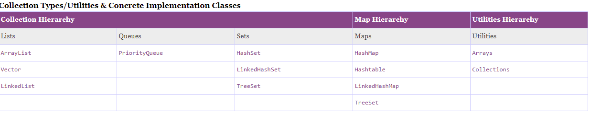

# Chương 7: Các vấn đề trong Collection

Trong chương này tôi sẽ chỉ liệt kê các thành phầ hay gặp chứ không nói chi tiết toàn bộ cả Collection

## 7.1 Tổng quan Collection

Colection bao gồm 4 kiểu lưu trữ như sau:

- Lists
- Maps
- Queues
- Sets

Cụ thể thì các nhóm này được phân như sau:



## 7.2 Các cấu trúc hay dùng của collection

### 7.2.1 nhóm list

Khi nào dùng ArrayList, vectors, LinkedList

đầu tiên tôi chia nó thnahf 2 nhóm.\
**Nhóm 1**: Nhóm đồng bộ hóa - vectors\
**Nhóm 2**: Nhóm bất đồng bộ - ArrayList, LinkedList

Nhóm đồng bộ ở đây nghĩa là khi nó được sử dụng trong đa luồng, khi có một tiến trình gọi tới một vector chung của các tiến trình thì nó phải chờ các tiến trình khác xử lý xong vertor mà các tiến trình này đang xư lý dở. Có thể hiểu vector là một loại tài nguyên duy nhất.

Nhóm bất đồng bộ ở đây có nghĩa là nó xử lý độc lập giữa các tiến trình.

Tùy thuộc vào loại xử lý và mục đích sử dụng ta sẽ chọn 1 trong 2 loại đồng bộ hoặc bất đồng bộ. nếu trong xử lý thông thường thì nên chọn loại bất đồng bộ bời vì đồng bộ sẽ phải có thêm lời gọi liên quan đến đồng bộ để check. tiếp đó là về cơ chế tạo phần tử mới

Ta có 1 ví dụ như sau:

Ta có 1 List hiện thời là 10 phần tử và chưng trinhg cũng cấp 10 phần tử là tối đa. nưng khi ta add phần tử thứ 11 thì chung trình sẽ add thêm 5 vùng đệm trống để chuẩn bị trước trong khi đó nếu ta dùng vector thì nó sẽ là tạo thêm 10 vị trí trống để chuẩn bị.

=> Nếu không thực sự cần thiết thì không dùng vector

Tiếp theo tôi sẽ phân tích\
Theo đúng như tên gọi arrayList lư trữ giống một array LinkedList lưu theo kiểu link list.

Tôi sẽ đánh thẳng vào vấn đề luôn

ArrayList tốt hơn để **`lưu trữ và truy cập`** dữ liệu.

LinkedList tốt hơn để **`thao tác dữ liệu`**.

nếu dữ liệu mảng cảu bạn là nhỏ thì dùng List

Nếu dữ liệu lớn và chủ dùng để truy cập thì dùng list.\
Còn nếu vừa lớn mà list vừa phải thay dổi thường xuyên thì nên dùng LinkedList.

### **`Note:`** lưu trữ kiểu LinkedList sẽ tốn bộ như hơn rất nhiều so với ArrayList

### 7.2.2 Queues

Trong phần này ta ko có nhiều lựa chọn :)

### 7.2.2 Sets

HashSet, LinkedHashSet, TreeSet chúng đều thuộc thành phần bất đồng bộ

Đầu tiên giá trị lưu trữ nếu giá trị lưu trữ cho phép null => cạch mặt thằng tree ra.

Muốn duy trì thứ tự chèn => LinkedHashSet

Không duy trì thứ tự chèn : HashSet, TreeSet

HashSet : các phần tử được chèn trên cơ sở mã băm của chúng.\
TreeSet : duy trì thứ tự tăng dần.

=> Hashset phục vụ tốt hơn cho mục tìm kiếm, TreeSet phục vụ tốt cho việc duyệt tập hợp theo thứ tự tăng dần hoặc phục vụ cho mục đích sắp sếp.

bạn để ý rằng khi add một phần từ vào cây thì nhánh tại vị trí insert sẽ phải vun đống lại vì vậy chi phí cho việc này được tính là lớn. Thế nên nếu yêu cầu là như nhau thì tôi khuyên bạn nên dùng  HashSet. ở đây có một vấn đề nữa đó là ban đầu 1 trong 2 thành phần này là như nhau. => chọn HashSet. Sau đó có sự thay dổi lại nghiệp vụ buộc phải chuyển thành TreeSet. khi đó sẽ buộc phải thay đổi về vấn đề này tối sẽ nói kĩ khi ở cuối chương.

### 7.2.3 Hash

HashMap, LinkedHashMap, TreeMap đều thuộc thành phần bất đồng bộ.

Nhóm này lưu trữ Map<Key, value>

Muốn duy trì thứ tự chèn : LinkedHashMap

Không duy trì thứ tự chèn : HashMap, TreeMap

Cũng giống như set TreeMap sẽ không để key là null.
và nó cũng được ưu tiên cho việc lưu trữ để sắp sếp.
và do vậy chi phí cho TreeMap là lớn hơn so với HashMap.

## 7.3 Khi nào nên chọn

Trong phần này tôi sẽ trả lời cho câu hỏi dùng nhóm nào?

Tôi sẽ cung cấp cho bạn sơ đồ về cách lựa chọn kiểu.


Tôi dừng ở đây và không nói gì thêm bởi sơ đồ đã có đủ thông tin mà bạn cần

## 7.4 Các chú ý và cách thức tiếp cận mở rộng

Tôi đưa ra 2 Chúy ý đầu tiên mà tôi đưa ra với nhóm list:

- Chú ý 1 : hi khởi tạo list ta nên khỏi tạo vùng bộ nhớ cần thiết nếu biết được số lượng phần tử một cách tương đối. điều này sẽ tốt hơn cho cơ chế cấp phát bộ nhớ của nó và nó sẽ làm tăng hiệu suất của chương trình.

- Chú ý 2 : các list tàn bộ không là các lớp bất biến vì vậy hay chú ý khi thay đổi các giá trịcảu phần tử trong hàm khi truyền tham số.

Tiếp theo tôi sẽ đuea ra cách thức code để tiếp cận sự mở rộng được tốt hơn.

Hãy xem sét ví dụ dưới:

```java
public class SomeClass {

  HashSet<String> someSet = new HashSet<String> ();

  protected HashSet<String> someBadMethod() {
    return this.someSet;
  }
}
```

Nhìn ví dụ trên ta có thể phán đoán được rằng cái Class này sẽ cho ra một cái set không có sắp sếp và không có theo thứ tự. Tuy nhiên nếu nghiệp vụ thay đổi hoặc khi có thêm sắp sếp lại nó thì sao đây. ta pahir đổi toàn bộ nó thành kiểu TreeSet trên tất cả các thành phần có mặt cảu nó bạn hình dung ra rằng nếu có 100 vị trí liên quan đến nó chẳng hạn , thì tôi sẽ tính là mức độ ảnh hưởng của nó là rất lớn đến chương trình hiện tại và ta buộc phải kiểm chứng lại các thay Đổi này có ảnh hưởng như thế nào đến chương trình hiện tại. Ở đây tối khuyen bạn nên dùng code phía dưới đây để thay thế chúng.

```java
public class SomeClass {

  Set<String> someSet = new HashSet<String> ();

  protected Set<String> someBadMethod() {
    return this.someSet;
  }
}
```

Ở đây tôi dùng interface của HashSet và TreeSet để làm kiểu dữ liệu mà tôi dùng. Như vậy khi thay đổi có thêm sắp sếp hoặc các tính năng khác thì bạn có thể chỉ cần thay đổi **`new HashSet<String> ();`** thành kiểu mà bạn muốn kể cả việc bạn tạo ra thêm một loại manual set được implement từ lớp `Set`.

Tranh thủ một chút ở đây về phần sắp sếp các đối tượng. nư các bạn đã thấy tree nó chứa các giá trị và ó sẽ thực sự tốt khi bạn chơi thành phần đơn lẻ còn các thành phần được định danh thì sẽ phưc tạp hơn nhiều

Ở đây tói nói thêm về hàm Equal cái mà bạn có thể ghi đè nó bởi vì cơ sở cảu tất cả các lớp này được kế thừa từ Class Object trong java.lang

khi bạn viết lại hàm này bạn phải tuân thủ đủ 3 nguyên tắc sau.

- Tính đối xứng : nếu x = y thì y cũng = x
- Tính bắc cầu : nếu x = y và y = z thì x cũng = z
- Bất cứ so sánh nào cũng từ chối với null, tức là x.equals(null) == false với mọi x ( tất nhiên là x khác null :) )
- Tính phản xa: x.equals(x) == True

Hàm compareTo cũng tương tự như vậy

tuy nhiên với việc sắp xếp trong list ta có 3 kiểu như sau

- Kiểu 1: viết nguyên một lớp manualComparator được kế thừa từ Comparator ( sẽ có lợi khi việc sắp sếp diến ra thường xuyên)
- Kiểu 2 thay vì viết lớp kế thừa Comparator thành một lớp cụ thể. ta có thể viết nó vào nội tại trong quá trình sắp sếp. ( ưu tiên khi chỉ sử dụng một lần và không sử dụng lại 1 lần thứ 2)
- Kiểu 3: Hãy để lớp cần sắp sếp và kế thừa nó từ Comparable và ta buộc phải viết lại method compareTo - nhược điểm của nó ở đây nó sẽ mang nặng hơn kiểu không kế thừa. đây cũng là một ý tưởng. Nhưng tôi sẽ không làm như vậy đâu :D.

## 7.5 Lưu ý khi duyệt collection

Ở đây tôi sẽ nói đến một số lưu ý khi duyệt collection.

Không sửa đổi Collection trong khi quá trình lặp vẫn đang diễn ra.

```java
public class SomeClass {

  protected void markPreferredCustomer(final String someCustomer) {

    Set set = new HashSet();
    String element = null;
    Iterator iter = set.iterator();

    while (iter.hasNext()) {
      element = (String) iter.next();
      //  . . . perform some logic
      if (element.equals(someCustomer)) {
        set.add(new String("p->" + element));
        set.remove(element);
      }
    }
  }
}
```

Ở đây **`set.remove(element)`** sẽ gây lỗi **`ConcurrentModificationException`**

Hãy lưu lại các phần tử càn xóa / cập nhật và thực hiện nó ngoài vòng duyệt của collection.

Trong quá trình lặp này nếu có sự thay đổi về dữ liệu thì ta cần phải xem set nó xem có được sử dụng trong các thread hay không. nếu có hãy để synchronized block để ngăn một luồng cố gắng sửa đổi trong khi một luồng khác đang lặp lại.

## 7.6 Tổng kết

Ở đây tôi chỉ nhắc đến một số điều

- Thứ nhất là việc lựa chọn kiểu dữ liệu bạn có thể lựa chọn tùy thuộc vào bài toán của bạn sao cho phù hợp
- Nếu 2 nhiều loại có thể sử dụng thì hãy ưu tiên loại có chi phí tháp hơn.
- Nên áp dụng interface của nó để có thể mở rộng sau này và ở đây tôi tuyên bố một lần nữa **`Interface là cách thức để giao tiếp chính giữa các module liên quan`**.
- Hãy chúy ý và ước lượng giá trị phần tử trung bình theo nghiêp vụ của cách sử dụng để được cấp phát bộ nhớ một cách hiệu quả cao
- Không sửa đổi Collection trong khi quá trình lặp vẫn đang diễn ra.
- Collection thì không nên để null trong trường hợp không có giá trị hãy khởi tạo một collection rỗng.
