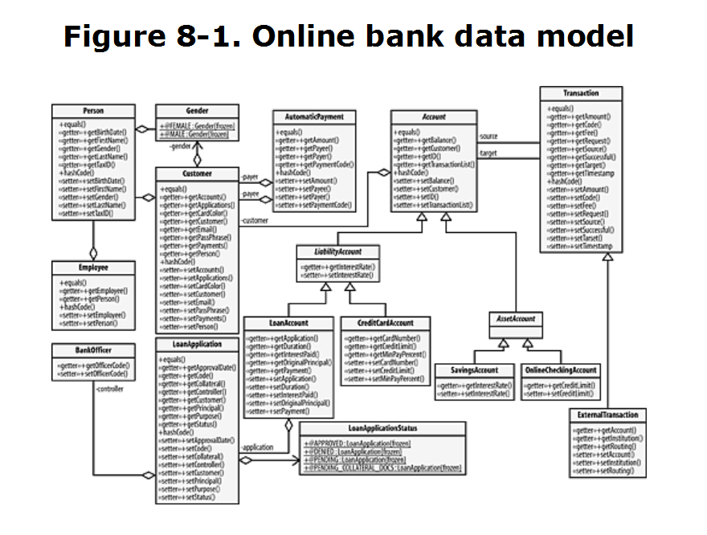

# Chương 17 Bàn luận về data modeling

Mô hình dữ liệu là một tập hợp các đối tượng được thiết kế để chứa dữ liệu liên quan đến một khái niệm hoặc ứng dụng nghiệp vụ cụ thể. Đối tượng mô hình dữ liệu là một thành phần của mô hình dữ liệu. Một đối tượng mô hình dữ liệu khác với một đối tượng thông thường chứa dữ liệu ở chỗ nó phải đại diện cho một khái niệm nghiệp vụ cụ thể.

Hãy nhớ rằng mỗ hình của một phần mềm và vô giá. Nó là dòng máu nuôi doanh nghiệp. do vậy bạn nên tránh làm hỏng mô hình dữ liệu bằng mọi giá. Các đối tượng mô hình dữ liệu của bạn cần phải chắc chắn hơn và không có lỗi hơn mọi phần khác của mã. Điều này nhất thiết có nghĩa là bạn sẽ phải sử dụng các quy trình kiểm tra và phát hiện lỗi mà bạn thường không quan tâm đến.

Mô hình hóa dữ liệu là bước đầu tiên trong quá trình triển khai một hệ thống phần mềm. Trên thực tế, mô hình dữ liệu tạo thành cốt lõi của bất kỳ dự án phần mềm nào. Nếu không có mô hình dữ liệu, sẽ có rất ít điểm cho ứng dụng phần mềm. Do đó, điều quan trọng là phải kiểm tra cách các mô hình dữ liệu được tạo ra bởi các lập trình viên chuyên nghiệp.

Trong chương này tôi sẽ không nói nhiều về code mà tôi sẽ nói về mô hình hóa dữ liệu.

## 17.1 Tài liệu yêu cầu

Lý tưởng nhất, một mô hình dữ liệu bắt đầu với một tài liệu yêu cầu, trong đó khách hàng chỉ định tất cả các khía cạnh của hệ thống. Khi tài liệu này được giao, các kiến trúc sư sẽ phân tích nó và trích xuất mô hình dữ liệu. Và tất nhiên cuộc sống đếch dễ dàng như trong lí tưởng.

### 17.1.1 Một quy trình vòng

Khách hàng hiếm khi biết đủ về những gì họ muốn trong phần mềm để viết một tài liệu yêu cầu đầy đủ. Mặc dù những người bạn làm việc cùng có thể khá thông minh, nhưng có khả năng tâm trí của họ không phù hợp với việc tổ chức thông tin để sử dụng trong một phần mềm. Giải pháp cho vấn đề này là bạn phải viết tài liệu yêu cầu cho chúng. Bằng cách nói chuyện với nhân viên của khách hàng, bạn có thể học được nhiều điều về công ty và hoạt động của nó. Điều này sẽ cho phép bạn viết bản nháp đầu tiên của tài liệu yêu cầu.

Khi bạn có bản thảo đầu tiên của tài liệu yêu cầu, khách hàng sẽ dễ dàng hiểu được cách phần mềm của họ sẽ được xây dựng như thế nào. Bước tiếp theo là xuất trình tài liệu cho khách hàng và hỏi xem liệu tài liệu có giải thích chính xác những gì anh ta muốn hay không. Luôn luôn, anh ta sẽ nói rằng nó gần gũi nhưng cần một số sửa đổi. Đây là bước khởi đầu của một quy trình lặp đi lặp lại trong đó khách hàng đề xuất các thay đổi đối với tài liệu yêu cầu và những thay đổi này được đưa vào tài liệu. Quá trình tiếp tục cho đến khi bạn và khách hàng đồng ý về những gì khả thi nhưng vẫn đáp ứng được nhu cầu của doanh nghiệp. Mặc dù điều này có vẻ dễ dàng, nhưng nó thực sự là phần khó khăn nhất của một dự án mới.

### 17.1.2 Nhận được sự chấp thuận của các yêu cầu

Dù bạn làm gì, đừng tiếp tục mà không có tài liệu yêu cầu. Các vấn đề của việc phải ứng biến là quá tốn kém. Một trong những vấn đề lớn nhất với cách tiếp cận nhanh và lỏng lẻo là bạn không có thước đo nào để đánh giá dự án là hoàn thành. Ngoài ra, nếu không có tài liệu yêu cầu cụ thể hóa các quy trình kinh doanh, một khái niệm hoặc phần thông tin quan trọng có thể hoàn toàn sai. Một sai lầm như vậy có thể khiến bạn mất hàng tuần, thậm chí hàng tháng trời làm việc và khiến thời hạn của bạn tan thành từng mảnh.

Nếu khách hàng có vẻ miễn cưỡng hoặc "quá bận" để đọc một tài liệu yêu cầu, có một số thủ thuật bạn có thể sử dụng để thúc đẩy họ. Đầu tiên chỉ đơn giản là nói, "Đây là những gì tôi sẽ xây dựng cho bạn nếu bạn không thay đổi." Điều này thường khuyến khích khách hàng nghiên cứu tài liệu. Bí quyết thứ hai là yêu cầu khách hàng ký tên vào tài liệu. Vì mọi người miễn cưỡng ký tên của họ vào một cái gì đó mà họ chưa đọc, có khả năng là khách hàng sẽ xem xét cẩn thận tài liệu và đề xuất thay đổi; tất nhiên, đây chính xác là những gì bạn muốn xảy ra.

### 17.1.3 Thu hẹp khoảng cách

Bạn nên làm cho khách hàng giải thích mọi thứ về doanh nghiệp của mình. Mặc dù bạn có thể biết khá nhiều về lĩnh vực mà bạn đang viết phần mềm, điều quan trọng là khách hàng phải giải thích mọi thứ cho bạn; cũng như anh ta không phải là chuyên gia về máy tính, bạn rất có thể không phải là chuyên gia trong lĩnh vực của anh ta. Khi một khách hàng nói về doanh nghiệp của anh ta, điều đó thường khiến anh ta suy nghĩ về các vấn đề của mình theo những cách mà anh ta chưa bao giờ xem xét trước đây. Mục tiêu của bạn phải là đóng vai trò là cầu nối giữa doanh nghiệp và thế giới máy tính.

Trước khi trình bày bản nháp đầu tiên của tài liệu yêu cầu, bạn nên trau dồi kỹ năng giao tiếp của mình. Cũng như bạn có thể không biết phiên mã RNA là gì, khách hàng không có khả năng biết decorator pattern là gì, hoặc sự khác biệt giữa kế thừa và tổng hợp. Giải thích bằng biệt ngữ và sử dụng nhiều phép ẩn dụ trong quá trình đáp ứng các yêu cầu. So sánh các thuật ngữ như kế thừa với các khái niệm mà khách hàng đã quen thuộc. Nó không quan trọng nếu anh ta không hiểu những điểm tốt hơn của khái niệm. Anh ấy chỉ cần biết đủ để hiểu bạn. Ví dụ: khi nói chuyện với giám đốc phát triển kinh doanh, bạn có thể sử dụng khái niệm một doanh nghiệp sở hữu một doanh nghiệp khác để đại diện cho ý tưởng tổng hợp hoặc thành phần. Bằng cách nói ẩn dụ, bạn sẽ có thể giao tiếp hiệu quả với khách hàng.

Sử dụng các kỹ thuật này sẽ giúp bạn trích xuất tài liệu yêu cầu từ ngay cả những khách hàng ngoan cố nhất. Khi tài liệu yêu cầu được hoàn thành, hãy sử dụng nó một cách rộng rãi và cập nhật nó một cách tôn giáo. Nếu các nhà phát triển của bạn thường xuyên mở tài liệu yêu cầu trên máy hoặc trên bàn của họ trong bản cứng, thì bạn đã làm rất tốt trong việc chuẩn bị nó.

## 17.2 Mô hình ngôn ngữ tự nhiên

Bước tiếp theo là chuyển tài liệu yêu cầu thành mô hình dữ liệu. Đối với một hệ thống đơn giản, không thực sự khó khăn để tìm ra nơi bắt đầu. Tuy nhiên, trong bối cảnh thế giới thực, việc chuyển đổi tài liệu yêu cầu sang mô hình dữ liệu có thể là một nhiệm vụ cực kỳ khó khăn. Phương pháp mô hình hóa ngôn ngữ tự nhiên giúp việc chuyển đổi này trở nên dễ dàng hơn nhiều.

Mô hình ngôn ngữ tự nhiên xem tài liệu yêu cầu như một diễn ngôn về trạng thái cuối cùng của ứng dụng. Từ bài diễn văn này, bạn có thể lọc các yếu tố khác nhau, giống như món mì spaghetti. Để làm được điều này, bạn cần có khả năng nhận ra phần nào của tài liệu cần lọc và phần nào để nguyên.

### 17.2.1 Bộ danh từ

Mô hình dữ liệu của bạn là tập hợp danh từ của ứng dụng của bạn. Nếu bạn đổ tài liệu yêu cầu qua "bộ lọc danh từ chính", bạn sẽ tìm thấy mô hình dữ liệu của ứng dụng. Các danh từ chính chỉ đơn giản là những từ xác định các khái niệm kinh doanh, chẳng hạn như tài khoản hoặc khách hàng. Khi bạn đã xác định được những danh từ này, hãy bắt đầu sắp xếp chúng thành các thứ bậc của các đối tượng. Trong khi đó, vứt bỏ những thứ không cần thiết chắc chắn sẽ ngấm vào và bạn sẽ có một khởi đầu mới. Bằng cách lọc các phần của tài liệu yêu cầu, bạn bắt đầu phát triển các phần lớn chương trình của mình. Bức tranh ban đầu sẽ không hoàn chỉnh, nhưng nó sẽ giúp bạn bắt đầu. Trên thực tế, bạn thực sự nên vẽ một bức tranh vào thời điểm này. Lấy công cụ mô hình hóa của bạn và bắt đầu cấu trúc các lớp và liên kết.

### 17.2.2 Một ứng dụng của mô hình ngôn ngữ tự nhiên

Hãy cùng khám phá một ứng dụng thực tế của cách xây dựng mô hình dữ liệu. Với mục đích của ví dụ này, bạn sẽ tạo một mô hình dữ liệu để đóng gói một tập hợp nhỏ các chức năng được sử dụng trong ngành ngân hàng. Đây là một tài liệu yêu cầu nhỏ cho mô hình dữ liệu của bạn:

  Thông số hệ thống của Ngân hàng Trực tuyến, Inc.

1. Hệ thống sẽ hỗ trợ các loại tài khoản séc, tiết kiệm, vay và thẻ tín dụng trực tuyến.
2. Tài khoản séc trực tuyến sẽ không trả lãi cho chủ tài khoản.
3. Tài khoản séc trực tuyến sẽ cho phép chủ tài khoản thực hiện chuyển tiền từ tài khoản của họ sang bất kỳ tài khoản nào khác trong hệ thống bằng phương thức điện tử.
4. Thanh toán phí ngân hàng hoặc thanh toán tự động sẽ được xử lý theo thứ tự sau. Đầu tiên, một nỗ lực sẽ được thực hiện để nhận được khoản thanh toán từ tài khoản séc trực tuyến của chủ tài khoản. Khi thất bại, khoản thanh toán sẽ được áp dụng so với tài khoản tiết kiệm của chủ tài khoản. Khi không thực hiện được khoản thanh toán này, một thông báo sẽ được gửi qua email cho khách hàng yêu cầu gửi tiền vào tài khoản cho khoản thanh toán.
5. Tài khoản séc trực tuyến sẽ cho phép chủ tài khoản thực hiện chuyển tiền bên ngoài cho một tổ chức bên ngoài, được cung cấp số định tuyến ngân hàng và số tài khoản.
6. Tài khoản séc trực tuyến sẽ có một hạn mức tín dụng thay đổi cho phép chủ tài khoản tạm thời giữ tài khoản dưới 0. Một nhân viên ngân hàng sẽ cần thiết để thiết lập giới hạn này.
7. Tài khoản tiết kiệm sẽ chỉ cho phép các giao dịch do nhân viên ngân hàng thực hiện. Các nhân viên này chỉ được chuyển tiền từ tài khoản tiết kiệm sang các tài khoản khác do chủ tài khoản tiết kiệm nắm giữ. Không có giao dịch nào từ tài khoản tiết kiệm được chuyển trực tiếp cho một bên thứ ba.
8. Ngân hàng sẽ hỗ trợ qua điện thoại để cá nhân tương tác với khách hàng.
9. Chủ tài khoản tiết kiệm sẽ được trả lãi cho số tiền trong tài khoản của họ.
10. Tài khoản cho vay là tài khoản đặc biệt để hoàn trả các khoản cấp tín dụng cho khách hàng. Các tài khoản này có thời hạn thanh toán và lãi suất do ngân hàng tính cho khoản vay. Khoản thanh toán khoản vay sẽ được thu theo yêu cầu 4 của tiêu chuẩn này.
11. Tài khoản thẻ tín dụng sẽ có một hạn mức tín dụng do một quan chức ngân hàng quy định.
12. Giao dịch viên ngân hàng bình thường sẽ không thể đặt hạn mức thẻ tín dụng.
13. Tài khoản thẻ tín dụng sẽ tự động thanh toán khoản thanh toán tối thiểu, được tính theo phần trăm số dư, theo yêu cầu 4 của đặc điểm kỹ thuật này.
14. Chủ tài khoản sẽ được cấp báo cáo hàng tháng chi tiết tình trạng tài khoản của họ và các giao dịch của tháng trước đó. Do những lo ngại về sinh thái, các giao dịch này sẽ chỉ được gửi qua email.
15. Khách hàng sẽ có thể đăng ký khoản vay trực tuyến.
16. Đơn xin vay trực tuyến sẽ yêu cầu ID của chủ tài khoản và thông tin liên quan để xử lý khoản vay. Thông tin được yêu cầu sẽ bao gồm mục đích cho khoản vay, mô tả về bất kỳ tài sản thế chấp nào được cung cấp, số tiền yêu cầu của khoản vay và thời hạn của khoản vay tính bằng tháng.
17. Chỉ có cán bộ ngân hàng mới được duyệt đơn vay trực tuyến. Nhân viên ngân hàng này sẽ ấn định lãi suất cố định hoặc lãi suất thay đổi cho khoản vay tùy thuộc vào nhận định duy nhất của anh ta.
18. Khách hàng sẽ được thông báo qua email về tình trạng chấp thuận hoặc từ chối khoản vay của họ.
19. Khách hàng sẽ được thông báo hàng năm về số tiền lãi phải trả của khoản vay.
20. Việc truy cập trực tuyến vào hệ thống ngân hàng sẽ được bảo vệ bằng các biện pháp an ninh phù hợp nhằm ngăn chặn các truy cập trái phép.
21. Trên điện thoại, tất cả khách hàng sẽ được yêu cầu có một cụm từ mật khẩu ngoài mật khẩu trực tuyến của họ để nhận dạng chính họ với nhân viên ngân hàng.
22. Khách hàng sẽ có thể thay đổi mật khẩu trực tuyến.
23. Phí ngân hàng sẽ được quản lý thông qua chuyển khoản vào tài khoản nội bộ của chính ngân hàng.
24. Mỗi viên chức sẽ có một mã quản trị về các vấn đề trả lương không liên quan đến sản phẩm này. Mã này sẽ là một số có 8 chữ số dương.

### 17.2.3 Tạo bộ danh từ

Bất cứ khi nào bạn tìm thấy một danh từ chính — là danh từ đứng riêng lẻ mà không cần trợ giúp và đại diện cho một khái niệm kinh doanh — hãy ghi nó vào danh sách các đối tượng ứng viên của bạn. Sau khi làm việc qua các yêu cầu, danh sách kết quả sẽ giống như sau:

1. Kiểm tra Tài khoản Trực tuyến
2. Tài khoản tiết kiệm
3. Tài khoản thẻ tín dụng
4. Tài khoản cho vay
5. Chuyển tiền
6. Chuyển tiền ra bên ngoài
7. Thanh toan tự động
8. Giao dịch
9. Nhân viên
10. Nhân viên ngân hàng
11. Chủ tài khoản
12. khách hàng
13. Đơn vay

Mặc dù hầu hết các yếu tố trong danh sách danh từ này khá rõ ràng, các yếu tố "Chuyển tiền" và "Chuyển tiền từ bên ngoài" yêu cầu giải thích thêm. Đối với mỗi lần chuyển tiền diễn ra, bạn cần ghi lại dữ liệu chỉ định thông tin chuyển tiền, chẳng hạn như nguồn và đích. Do đó, bạn cần một đối tượng để nắm giữ thông tin này. Theo kế thừa, Chuyển Tiền Bên Ngoài là một danh từ vì nó là một loại Chuyển Khoản đặc biệt.

Mặt khác, hành động trong yêu cầu 22 không yêu cầu bất kỳ hỗ trợ nào thêm. Vì mật khẩu được lưu trữ trong tài khoản của người dùng và việc thay đổi mật khẩu chỉ đơn giản là cung cấp giao diện để hoàn thành tác vụ, bạn không cần tạo đối tượng trợ giúp để lưu trữ dữ liệu. Tuy nhiên, nếu tài liệu yêu cầu bạn lưu trữ ngày người dùng thay đổi mật khẩu, thì bạn sẽ cần thực hiện một số hỗ trợ. Trong khi làm việc với tài liệu, hãy đảm bảo rằng bạn để mắt đến các đối tượng trợ giúp động từ và xử lý chúng một cách thích hợp.

### 17.2.4 Chuyển sang mô hình dữ liệu

Sau khi tài liệu yêu cầu được ký, bạn có thể muốn bắt đầu lập kế hoạch cho các bảng cơ sở dữ liệu và sơ đồ mối quan hệ thực thể. Tuy nhiên, ở giai đoạn này, mô hình dữ liệu phải là trọng tâm hàng đầu, không phải là cơ sở dữ liệu. Cơ sở dữ liệu nên được xem như một cơ chế lưu trữ khác, không liên quan ở giai đoạn lập kế hoạch này. Do đó, bạn nên xác định mô hình dữ liệu bằng cách sử dụng các nguyên tắc hướng đối tượng và sau đó tìm ra cách để thực sự lưu trữ dữ liệu.

Với danh sách các danh từ chính, hệ thống đề xuất trông không còn phức tạp nữa. Bây giờ bạn đã có một danh sách, bạn có thể bắt đầu tạo một số lớp trong công cụ lập mô hình ngôn ngữ mô hình thống nhất (UML) của mình.

Bắt đầu lập kế hoạch mô hình dữ liệu bằng cách tạo các lớp trống, một lớp cho mỗi danh từ chính và để công cụ lập mô hình của bạn để lại nội dung cho phần sau. Khi bạn có các lớp trống của mình, hãy cố gắng sắp xếp các đối tượng thành các nhóm và phân cấp. Trong khi tổ chức các đối tượng, hãy đảm bảo rằng bạn loại bỏ bất kỳ bản sao khái niệm nào. Ví dụ: bạn có thể loại bỏ AccountHolder vì nó giống với Khách hàng. Tiếp tục tinh chỉnh cấu trúc và tìm kiếm những điểm chung giữa các đối tượng cho đến khi xuất hiện một mô hình gắn kết. Trong khi tinh chỉnh, hãy nhớ đừng lo lắng về các chi tiết của mô hình. Tại thời điểm này, bạn chỉ nên cố gắng hoàn thiện bộ xương của mô hình dữ liệu của mình tại chỗ; một khi điều này được thực hiện, khung sẽ cung cấp cho bạn một nền tảng tốt hơn nhiều để kết hợp các chi tiết của mô hình

### 17.2.5 Các mối quan hệ và thuộc tính

Bây giờ khung đã hoàn thành, bạn có thể điền vào mô hình dữ liệu của mình với các mối quan hệ và thuộc tính. Một lần nữa, hãy tham khảo tài liệu yêu cầu và ghi chú từng lần xuất hiện của các đối tượng cốt lõi trong tài liệu. Ví dụ: hãy xem xét yêu cầu số 5:

`5. Tài khoản séc trực tuyến sẽ cho phép chủ tài khoản thực hiện chuyển tiền bên ngoài cho một tổ chức bên ngoài, được cung cấp số định tuyến ngân hàng và số tài khoản`

Từ yêu cầu này, bạn biết rằng cần có mối quan hệ giữa các lớp OnlineCheckingAccount và ExternalTransaction. Hơn nữa, lớp Giao dịch bên ngoài yêu cầu thêm số định tuyến ngân hàng và số tài khoản làm thuộc tính. Khi bạn làm việc với tài liệu, hãy điền vào mô hình dữ liệu của ứng dụng với các chi tiết như sau.

Khi bạn đã phân tích xong tài liệu yêu cầu, hãy bắt đầu bước thứ hai, trong đó bạn kiểm tra từng đối tượng của mình và xem xét chúng riêng biệt. Ví dụ, bạn không bao giờ đề cập trong tài liệu yêu cầu rằng một người cần phải có họ và tên. Tuy nhiên, dữ liệu này là ngụ ý, vì vậy bạn nên thêm nó. Tiếp tục loại phân tích này cho đến khi bạn cảm thấy rằng bạn có một mô hình dữ liệu khá hoàn chỉnh.

### 17.2.6 Bản thảo đầu tiên

Bây giờ bạn đã có bản nháp của mô hình, hãy đưa mô hình đó lại cho khách hàng và để anh ta chọn nó thành từng mảnh. Tại thời điểm này, điều tối quan trọng là bạn đừng quên rằng khách hàng của bạn không phải là lập trình viên. Nếu bạn gửi sơ đồ này qua email cho khách hàng và hỏi ý kiến của họ, tôi đảm bảo rằng bạn sẽ được chào đón trong sự im lặng. Tất cả các ký hiệu được sử dụng trong UML đối với bạn là bản chất thứ hai, nhưng thường giống với tiếng Hy Lạp đối với khách hàng.

Thay vào đó, hãy trình bày mô hình dữ liệu cho khách hàng thành từng phần nhỏ tập trung vào các khái niệm riêng lẻ. Cách tốt nhất để làm điều này là gặp trực tiếp khách hàng tại một địa điểm mà anh ta có thể tập trung vào mô hình dữ liệu và không bị phân tâm bởi những mối quan tâm khác. Cuộc họp cũng sẽ cho anh ta cơ hội để đặt câu hỏi. Bạn cũng sẽ có thể hỏi bất kỳ câu hỏi nào bạn có và đảm bảo rằng khách hàng bám sát các khái niệm có thể đạt được trên thực tế.

Trong quá trình trình bày mô hình dữ liệu, hãy đảm bảo giải thích các ký hiệu và ký hiệu bằng các thuật ngữ đơn giản nhất có thể. Điều quan trọng là sự khác biệt giữa tổng hợp và thành phần là rõ ràng; điều quan trọng là khách hàng của bạn hiểu tại sao lại có một đường kết nối hai đối tượng. Như tôi đã nói, mục tiêu của bạn phải là nhận được sự chấp thuận bằng lời nói hoặc tốt nhất là bằng văn bản.

Một khi khách hàng chấp nhận các yêu cầu và mô hình dữ liệu, câu chuyện vẫn chưa kết thúc. Trên thực tế, việc phân tích và sửa đổi các yêu cầu và mô hình dữ liệu sẽ là một chủ đề lặp đi lặp lại trong suốt quá trình phát triển khi các yêu cầu thay đổi, các khái niệm mới được phát hiện và các câu hỏi cũ được trả lời. Một thực tế đơn giản của kinh doanh là mô hình và yêu cầu của bạn sẽ bị thay đổi trong khi bạn hoàn thành dự án.

Ngay cả sau khi phần mềm được phát hành, sẽ có nhiều yêu cầu hơn và thay đổi mô hình dữ liệu. Các yêu cầu mới nên đi trong phần riêng của tài liệu yêu cầu để tách chúng khỏi các yêu cầu ban đầu. Bạn sẽ phải tích hợp các thay đổi mô hình dữ liệu liên tục, nhưng cố gắng đừng làm như vậy nếu không có đặc tả yêu cầu. Thay đổi một câu trong tài liệu hoặc một dòng trong bản vẽ sẽ dễ dàng hơn nhiều so với thay đổi mã.



## 17.3 Các khía cạnh của mô hình dữ liệu được thiết kế tốt

### 17.3.1 Lớp ma

Một điều bạn cần lưu ý về mô hình dữ liệu Ngân hàng Trực tuyến là lớp `AssetAccount` `không có thuộc tính hoặc mối quan hệ` (hình bên trên). Lớp AssetAccount là một loại lớp đặc biệt được gọi là lớp ma. Một lớp ma đánh dấu một sự thay đổi khái niệm.

Trong mô hình dữ liệu của bạn, hai lớp `OnlineCheckingAccount` và SavingsAccount đều là tài sản đối với khách hàng của bạn. Mặt khác, các lớp `CreditCardAccount` và `LoanAccount` là trách nhiệm pháp lý đối với khách hàng của bạn. Nếu không có một lớp đánh dấu phân tách tài sản khỏi nợ phải trả, cả bốn lớp này sẽ kế thừa từ `Account`, xóa bỏ sự khác biệt quan trọng giữa tài sản và nợ phải trả.

Bằng cách tạo lớp ma `AssetAccount` , bạn có được tính linh hoạt, sức mạnh và khả năng tồn tại lâu dài hơn trong mô hình dữ liệu của mình. Vì các lớp `OnlineCheckingAccount` và `SavingsAccount` đại diện cho sự khác biệt về khái niệm giữa hai tài khoản còn lại, bạn có thể hiểu về một phần logic sẽ phải đưa ra quyết định dựa trên sự khác biệt về khái niệm này. Ví dụ, các nhân viên ngân hàng của bạn có thể muốn viết một báo cáo về tất cả các tài sản được ghi nhận cho một khách hàng cụ thể. Để hoàn thành báo cáo này, anh ta chỉ muốn kiểm tra các đối tượng tài khoản tài sản.

Tất nhiên, bạn có thể cân nhắc sử dụng cờ trong mỗi lớp và để cờ phân biệt giữa tài sản và nợ phải trả. Tuy nhiên, đặt một cờ trong lớp báo hiệu liệu lớp đó là tài sản hay nợ phải trả là cách tiếp cận sai lầm vì nếu bạn nghĩ đến một danh mục tài khoản khác và muốn triển khai nó trong các bản sửa đổi sau, một cờ đơn giản sẽ không hoạt động. Để khắc phục điều này, bạn sẽ phải xem qua tất cả logic nghiệp vụ và thay đổi logic để tính cho loại tài khoản mới. Tuy nhiên, nếu các lớp của bạn được phân chia theo khái niệm bằng một lớp ma, công việc này sẽ không cần thiết. Bạn chỉ cần tạo một lớp ma mới cho mỗi loại tài khoản mới và cấu trúc sẽ được giữ nguyên. Với kỹ thuật này, chính cấu trúc của mô hình được sử dụng để đóng gói thông tin.

Ngoài ra, vì `AssetAccount` đại diện cho một sự thay đổi khái niệm, không khó để hình dung một yêu cầu tiếp theo sẽ yêu cầu một thành viên dữ liệu trong lớp Asset. Giả sử sau sáu tháng, sếp của bạn đến và yêu cầu bạn thêm một thuộc tính mới vào hệ thống. Nếu bạn đã sử dụng một cờ thay vì một lớp ma, bây giờ bạn có một sự lựa chọn. Hoặc là bạn tạo ra một số loại sai lầm cẩu thả hoặc bạn cấu trúc lại mô hình dữ liệu để bao gồm một lớp `AssetAccount`. Một trong hai lựa chọn không hấp dẫn. Tốt hơn hết là bạn nên sử dụng một lớp ma ngay từ đầu và tránh rắc rối cho chính mình.

### 17.3.2 Mối quan hệ đúng đắn

Bạn có thể nhận thấy rằng kế thừa không được sử dụng trong các lớp `Customer` và `Employee` để mở rộng lớp `Person`. Điều này là do nó không được bảo hành tại thời điểm này. Nhiều nhà phát triển có xu hướng sử dụng kế thừa khi tổng hợp sẽ thích hợp hơn. Trong trường hợp này, một `Person` có thể đảm nhận vai trò của `Customer`, `Employee` hoặc cả hai.

Trong kỹ thuật hướng đối tượng, có ba câu hỏi truyền thống xác định mối quan hệ giữa các đối tượng. Các câu hỏi "is a", "has a" và "uses  a", mỗi câu hỏi xác định các mối quan hệ khác nhau với ngữ nghĩa khác nhau. Sử dụng từng loại mối quan hệ đúng cách là rất quan trọng trong việc tạo ra một mô hình dữ liệu gắn kết và ổn định.

### 17.3.2.1 Is a

Câu hỏi "is a" xác định tính kế thừa. Nếu bạn nói rằng một đối tượng này là một đối tượng khác, thì bạn sử dụng kế thừa. Trong trường hợp của `SavingsAccount`, bạn có thể nói rằng `SavingsAccount` là một loại `AssetAccount`. Mối quan hệ này được thể hiện như hình dưới


Tuy nhiên, với lớp `Customer`, câu hỏi trở nên phức tạp. Bạn có thể nói rằng `Customer` là một `Person`; tuy nhiên, một `Customer` không phải là một `Person`. Thay vào đó, `Customer` là một trong nhiều vai trò của một `Person`; `Person` là một phần của khái niệm `Customer`, vì vậy cần phải tổng hợp. Nếu bạn thay đổi từ truyền thống "is a" câu hỏi thành "is a type of", thì kết quả trở nên rõ ràng hơn nhiều: BankOfficer là một loại `Employee` nhưng `Customer` không phải là một loại `Person`.

Sử dụng kế thừa không đúng cách là một sai lầm phổ biến trong mô hình hóa dữ liệu, một lỗi có thể gây ra một số tác dụng phụ không mong muốn. Ví dụ: nếu bạn lập mô hình `Customer` và `Employee` là kế thừa từ `Person`, thì cùng một người có thể ở trong hệ thống của bạn hai lần: đối với nhân viên của công ty và khi người đó mở tài khoản mới. Khi bạn thay đổi địa chỉ của người đó, hãy nhớ thay đổi cả hai trường hợp của người đó. Kiểu trùng lặp dữ liệu này chỉ là yêu cầu đưa các lỗi vào hệ thống.

### 17.3.2.2 Has a

Câu hỏi "has" xác định tổng hợp. Nếu bạn nói rằng một đối tượng này có một đối tượng khác, thì đối tượng có đối tượng kia tập hợp nó lại. Ví dụ, một khách hàng có một người được liên kết với nó.

Tổng hợp thực sự là một kiểu liên kết đặc biệt mô hình hóa mối quan hệ trong đó đối tượng thực hiện phép tổng hợp là tổng thể và đối tượng được tổng hợp là một bộ phận. Loại tập hợp này thường được gọi là tập hợp chia sẻ vì một số lớp có thể tập hợp lớp tổng hợp. Ví dụ: `Person` và `Customer` chia sẻ mối quan hệ tổng hợp vì người đó tạo thành một phần của khách hàng; hơn nữa, người đó cũng có thể là một nhân viên, có nghĩa là tập hợp được chia sẻ.


Ngoài ra còn có một kiểu tập hợp đặc biệt được gọi là thành phần, xảy ra khi một đối tượng kết hợp một đối tượng khác và có quyền kiểm soát vòng đời đối với đối tượng đó. Ví dụ, lớp HashMap sử dụng một lớp bên trong được gọi là Entry để triển khai các nhóm lưu trữ của nó. Các đối tượng Entry này chỉ có thể tồn tại trong ngữ cảnh của HashMap; chúng không thể tự tồn tại.


Thành phần cũng ngụ ý rằng chỉ một lớp có thể tạo một đối tượng; các lớp khác có thể sử dụng nó, nhưng chỉ một lớp có thể là chủ sở hữu của nó. Trong thực tế, các đối tượng sáng tác hiếm khi được chia sẻ nhưng được cách ly trong quyền truy cập riêng tư. Một mục vào HashMap chỉ có thể được tạo bởi chính HashMap.

### 17.3.2.3 Uses a

Câu hỏi "Uses a" chỉ ra liên kết đơn giản, trong đó một lớp có thể điều hướng đến một lớp khác và sử dụng các dịch vụ của lớp đó. Trong sự liên kết, các lớp về mặt khái niệm ở cùng một cấp độ. Ví dụ: một giao dịch sử dụng một tài khoản và do đó được liên kết với nó. Tuy nhiên, Tài khoản và Giao dịch ở cùng cấp độ khái niệm và không phải là một phần của cái kia, nhưng bạn cần điều hướng giữa hai thứ, vì vậy bạn sử dụng một liên kết đơn giản.


Nếu bạn muốn biết thêm thông tin về các khái niệm đằng sau mô hình hóa UML, hãy chọn bản sao của Hướng dẫn sử dụng ngôn ngữ lập mô hình thống nhất của Booch, Rumbaugh và Jacobson (Addison-Wesley).

## 17.3.3 Một câu hỏi ban đầu

Trong toàn bộ mô hình dữ liệu Ngân hàng Trực tuyến, các loại trình bao bọc được sử dụng cho tất cả các kiểu nguyên thủy. Không có đối tượng nguyên thủy nào được sử dụng trong mô hình. Quyết định này bắt nguồn từ một câu hỏi đơn giản, "Làm thế nào để bạn đối phó với null trên một trường nguyên thủy?"

Đôi khi một giá trị có thể rỗng trong mô hình dữ liệu của bạn mà không phải là một lỗi. Hãy xem xét lớp `Transaction`. Trong lớp này, có một Boolean cho biết sự thành công hay thất bại của giao dịch. Tuy nhiên, nếu giao dịch chưa được gửi, thuộc tính này có thể là giá trị pháp lý. Nếu bạn đã viết lớp với các nguyên thủy, các phương thức thuộc tính sẽ giống như sau:

```java
public class Transaction {
    public boolean successful;

    public void setSuccessful( final boolean successful ) {
        this.successful = successful;
    }

    public boolean getSuccessful() {
        return this.successful;
    }
}
```

Vì thuộc tính `successful` trong ví dụ này là thuộc tính nguyên thủy, bạn không thể đặt giá trị của nó thành null. Để bù đắp, bạn có thể nói rằng các giao dịch không thành công cho đến khi chúng thành công. Tuy nhiên, điều này sẽ cung cấp thông tin sai lệch cho khách hàng của bạn. Họ sẽ đăng nhập để kiểm tra danh sách giao dịch của mình, tìm thấy một số giao dịch không thành công và bắt đầu tự hỏi tại sao. Mặt khác, nếu bạn sử dụng loại trình bao bọc thay vì loại nguyên thủy, bạn sẽ có mã sau cho thuộc tính của mình:

```java
public class Transaction {
    public Boolean successful;

    public void setSuccessful( final Boolean successful ) {
        this.successful = successful;
    }

    public Boolean getSuccessful() {
        return this.successful;
    }
}
```

Trong trường hợp này, hợp pháp bạn có thể đặt giá trị của `successful` là null. Vì thuộc tính là một đối tượng Boolean nên nó có thể chứa giá trị null. Trong trường hợp này, bạn có thể tránh sự mơ hồ của các giao dịch chưa được gửi bằng cách đặt thành công của chúng thành null.

Trong suốt mô hình dữ liệu của mình, bạn cần quyết định xem có nên sử dụng nguyên mẫu hay không. Một tùy chọn là chỉ sử dụng các loại trình bao bọc cho các thuộc tính có thể là null. Tùy chọn thứ hai là chuyển đổi mọi nguyên thủy trong mô hình dữ liệu thành các lớp trình bao bọc liên quan của chúng.

## 17.3.3.1 Sử dụng một phần các nguyên thủy

sử wrappers cho chỉ các thuộc tính có thể là null hợp pháp có thể tiết kiệm một lượng nhỏ bộ nhớ cho mỗi đối tượng. Tuy nhiên, bộ nhớ bổ sung này hầu như không đáng kể trừ khi bạn đang lưu trữ hàng nghìn con số, trong trường hợp đó, bạn rất có thể sẽ sử dụng cấu trúc dữ liệu phức tạp chẳng hạn như một mảng. Thuộc tính mảng đã có thể chứa null dưới dạng giá trị.

Ngoài ra, việc sử dụng các biến nguyên thủy cho một phần của mô hình dữ liệu sẽ làm sạch toán học với các biến nguyên thủy:

```java
public void calcMonthlyInterest( final LoanAccount loan ) {

    // -- Using Primitives
    float interest = loan.getBalance() * loan.getInterestRate();

    // -- Using Wrappers
    float interest = loan.getBalance().floatValue() * loan.getInterestRate().floatValue();
 }
```

Các thuộc tính nguyên thủy cũng loại bỏ sự cần thiết phải tạo các đối tượng khi gọi một setter:

```java
public void adjustLoan( final LoanAccount loan ) {

    // -- Using Primitives
    loan.setInterestRate(0.0565);

    // -- Using Wrappers
    loan.setInterestRate(new Float(0.0565));
}
```

## 17.3.3.2 Chỉ sử dụng các loại trình bao bọc (Wrappers)

Sử dụng các loại trình bao bọc cho tất cả các nguyên thủy có thể làm rõ ngữ nghĩa khi xử lý mô hình. Nếu bạn chỉ sử dụng các trình bao bọc nguyên thủy, mọi thứ đều là một đối tượng. Tất cả các getters trả về các đối tượng và tất cả các setters lấy các đối tượng làm đối số. Điều này thuận tiện khi xử lý phản xạ (reflection - chương 18)

Ngoài ra, việc sử dụng các trình bao bọc nguyên thủy hoàn toàn giúp loại bỏ nhu cầu về nhiều đối tượng tạm thời, điều này sẽ được yêu cầu nếu thuộc tính là nguyên thủy. Ví dụ: hãy xem xét bộ thiết lập thuộc tính ràng buộc cơ bản của bạn:

```java
// -- Using Primitives
public void setInterestRate( final float interestRate ) {
    float oldInterestRate = this.interestRate;
    this.interestRate = interestRate;
    propertyChangeSupport.firePropertyChange("interestRate ", new Float(interestRate), new Float(interestRate));
}

// -- Using Wrappers.
public void setInterestRate( final Float interestRate ) {
    Float oldInterestRate = this.interestRate;
    this.interestRate = interestRate;
    propertyChangeSupport.firePropertyChange("interestRate ", interestRate, interestRate);
}
```

Bạn lưu hai interestRate đối tượng cho mỗi cuộc gọi bằng cách sử dụng kiểu được bọc; các interestRate được giao dịch cho một lần setter. Vì việc tạo các đối tượng mới trên heap là một công việc tương đối tốn thời gian, nên việc tránh nó sẽ tiết kiệm một phần thời gian cho CPU.

Ngay cả khi có rất nhiều phép toán, các trình bao bọc sẽ không ảnh hưởng đến hiệu suất. Nếu bạn tuân theo các nguyên tắc về hiệu quả của mã, sự khác biệt giữa trình bao bọc và nguyên thủy không còn là một vấn đề. Hãy xem xét ví dụ có vấn đề sau:

```java
// -- Using Primitives
public void doMath (final MyFactorObject obj) {
  float result;
  while(someCondition) {
    result = result * obj.getFactor();
  }
}

// -- Using Wrappers.
public void doMath(final MyFactorObject obj) {
  float result;
  while(someCondition) {
    result = result * obj.getFactor().floatValue();
  }
}
```

Loại mã phổ biến này cho thấy sự khác biệt giữa việc sử dụng một trình bao bọc và một loại nguyên thủy. Bất cứ khi nào bạn lặp qua vòng lặp, bạn phải thực hiện thêm một cuộc gọi phương thức. Tuy nhiên, mã này được thiết kế kém. Gọi một phương thức luôn trả về cùng một kết quả nhiều lần trong cùng một phương thức là một phương pháp không tốt. Việc gọi một phương thức luôn trả về cùng một kết quả trong một vòng lặp thậm chí còn tệ hơn. Với mỗi lần lặp lại của vòng lặp, bạn sẽ mất một số chu kỳ đồng hồ. Để giải quyết vấn đề này, bạn có thể cấu trúc lại phương thức:

```java
// -- Using Primitives
public void doMath (final MyFactorObject obj) {
  float result;
  float factor = obj.getFactor();
  while(someCondition) {
    result = result * factor;
  }
}

// -- Using Wrappers.
public void doMath(final MyFactorObject obj) {
  float result;
  float factor = obj.getFactor().floatValue();
  while(someCondition) {
    result = result * factor; // <-- Speedy!!!
  }
}
```

Sự khác biệt giữa hai phương thức được tối ưu hóa bây giờ chỉ là một lệnh gọi tới floatValue() — một chút chi phí khá nhỏ. Bạn có thể loại bỏ lệnh gọi bổ sung này bằng cách sử dụng các giá trị nguyên thủy, nhưng sau đó bạn sẽ mất tất cả lợi thế của các giá trị này là các đối tượng thực tế. Khi thực hiện hầu hết các phép toán, sẽ có những khác biệt nhỏ tương tự giữa việc sử dụng nguyên thủy và trình bao bọc. Mặc dù bạn có thể tiết kiệm những khoản chi phí nhỏ này bằng cách sử dụng nguyên thủy, nhưng bạn phải hy sinh tính nhất quán và tính linh hoạt trong mô hình dữ liệu của mình.

Cuối cùng, đi với các loại wrapper thuần túy có nhiều ưu điểm hơn là nhược điểm. Sự gia tăng tốc độ mà nguyên thủy mang lại cho bạn không vượt trội hơn sự rõ ràng và linh hoạt của việc sử dụng trình bao bọc. Tôi khuyên bạn nên sử dụng các trình bao bọc thay vì các trình tự nguyên thủy trong các đối tượng mô hình dữ liệu.

## 17.3.4 Mutable Objects

Trong mô hình dữ liệu, tất cả các đối tượng thuộc hai loại. Chúng là các đối tượng không đổi, như trong trường hợp của `Gender` và `LoanApplicationStatus`, hoặc chúng là các đối tượng mô hình dữ liệu có thể thay đổi, như trong trường hợp của `Person` và `Account`.

Các đối tượng có thể thay đổi trong mô hình có nhiều điểm chung. Vì chúng đều là các bean Java và tất cả các thuộc tính của chúng đều bị ràng buộc, chúng đều cần hỗ trợ thay đổi thuộc tính cho các sự kiện của chúng. Vì tất cả họ đều cần nó, chỉ cần đẩy hỗ trợ này vào một lớp cơ sở được gọi là Mutabl eObject.

```java
public abstract class MutableObject implements Serializable {

    private static final transient Logger LOGGER = Logger.getLogger(MutableObject.class);

    private static final long serialVersionUID = 7902971632143872731L;

    protected final transient PropertyChangeSupport propertyChangeSupport = new PropertyChangeSupport(this);

    protected MutableObject() {
    }

    public void addPropertyChangeListener( final PropertyChangeListener listener ) {
        propertyChangeSupport.addPropertyChangeListener(listener);
    }

    public void addPropertyChangeListener( final String property, final PropertyChangeListener listener ) {
        propertyChangeSupport.addPropertyChangeListener(property, listener);
    }

    public void removePropertyChangeListener( final PropertyChangeListener listener ) {
        propertyChangeSupport.removePropertyChangeListener(listener);
    }

    public void removePropertyChangeListener( final String property, final PropertyChangeListener listener ) {
        propertyChangeSupport.removePropertyChangeListener(property, listener);
    }

}
```

Nếu bạn đang phát triển phần mềm cho một công ty, bạn sẽ đặt MutableObject trong một gói phần mềm chung để các ứng dụng khác có thể sử dụng dịch vụ của nó. Lớp MutableObject sẽ tạo thành lớp cơ sở cho tất cả các đối tượng mô hình dữ liệu. Tôi sẽ đặt nhiều chức năng hơn vào lớp MutableObject để cung cấp cho các mô hình dữ liệu của bạn nhiều sức mạnh hơn nữa.

### 17.3.4.1 Đồng nhất và bình đẳng cho tất cả các đối tượng

Có một vấn đề nhỏ khác trong mô hình dữ liệu của bạn. Nhớ lại các phần trước rằng việc triển khai mặc định của phương thức equals() trong java.lang.Object sẽ so sánh các đối tượng theo danh tính hơn là bình đẳng. Vì bạn chưa ghi đè phương thức mặc định, bạn không thể biết khi nào một đối tượng tương đương với một đối tượng khác.

Vấn đề này có thể dễ dàng giải quyết bằng cách nhớ khai báo cả phương thức equals() và hashCode() trên tất cả các đối tượng dữ liệu hoặc các lớp cha của chúng, nếu thích hợp. Ví dụ: bạn có thể khai báo rằng các đối tượng `Account` và tất cả các đối tượng con của chúng sử dụng thuộc tính ID để so sánh cho tương đương. Do đó, bạn có thể khai báo phương thức equals() và hashCode() trong `Account`, phương thức này sẽ áp dụng cho tất cả các phương thức con:

```java
public abstract class Account extends MutableObject {

    public boolean equals( final Object obj ) {
        if (!(obj instanceof Account)) {
            return false;
        } else {
            return (((Account) obj).getID().equals(this.ID));
        }
    }
    
    public int hashCode() {
        return this.ID.hashCode();
    }
}
```

Điều này sẽ hoạt động cho tất cả các loại tài khoản con. Bây giờ bạn chỉ cần đi qua tất cả các đối tượng dữ liệu khác và lặp lại quá trình.

Tuy nhiên, nếu bạn quên triển khai các phương thức cho một trong các đối tượng dữ liệu của mình, bạn sẽ gặp phải vấn đề nghiêm trọng. Vì các phương thức equals() và hashCode() được khai báo trong Object, sẽ không có lỗi hoặc cảnh báo trình biên dịch nào. Bạn có thể nhận thấy vấn đề chỉ sau khi bạn thực hiện một phiên gỡ lỗi kéo dài cả đêm để cố gắng tìm ra lý do tại sao báo cáo của người quản lý của bạn không bao gồm các tài khoản cho vay. May mắn thay, có một cách để tránh điều này trước khi nó xảy ra.

Một trong những khía cạnh thú vị và ít được biết đến của Java là bạn có thể tái cấu trúc một phương thức từ một lớp cơ sở. Miễn là một phương thức không được khai báo là cuối cùng khi bạn kế thừa phương thức trong lớp của mình, bạn có thể thêm từ khóa trừu tượng vào khai báo của nó; điều này sẽ buộc người dùng trong lớp của bạn triển khai phương thức. Bạn có thể thay đổi MutableObject để kích hoạt lại equals() và hashCode():

```java
public abstract class MutableObject implements Serializable {
  public abstract boolean equals(Object obj);
  public abstract int hashCode( );
}
```

Bây giờ hashCode() và equals() là trừu tượng, bất kỳ lớp nào đi xuống từ MutableObject sẽ phải triển khai hai phương thức này ở đâu đó dọc theo hệ thống phân cấp lớp của nó. Nếu các phương thức không được khai báo, trình biên dịch sẽ phản đối rằng lớp cần được khai báo là trừu tượng. Thủ thuật này là một công cụ vô giá trong việc buộc con cháu của một lớp phải triển khai các tính năng nhất định.

## 17.4 Ràng buộc về dữ liệu có thể tái sử dụng

Khi đặt dữ liệu vào mô hình dữ liệu, bạn cho phép người dùng thực tế đặt bất kỳ thứ gì vào các trường khác nhau miễn là họ sử dụng đúng kiểu dữ liệu. Ví dụ: người dùng có thể nhập null cho lãi suất và làm hệ thống bị hỏng khi nó cố gắng tính lãi suất. Tệ hơn nữa, một người dùng có thể dễ dàng nhập -5,45 cho lãi suất trên thẻ tín dụng của cô ấy. Ngân hàng có thể thấy hơi tốn kém khi phải trả cho khách hàng lãi suất 545% khi hết thẻ tín dụng của cô ấy! Rõ ràng, bạn cần đặt một số ràng buộc đối với các thành viên dữ liệu trong suốt mô hình.

Đối với lãi suất có vấn đề, điều tự nhiên cần làm là thêm mã kiểm tra vào bộ định mức lãi suất trong lớp `LiabilityAccount`. Mã này sẽ ngăn chặn bất kỳ giá trị âm nào và giới hạn tốc độ ở mức 1,0 hoặc thấp hơn. Bộ thiết lập thuộc tính đã sửa đổi của bạn sẽ trông giống như sau:

```java
public void setInterestRate(final Float interestRate) {
  if ((interestRate.floatValue( ) > 1.0f) || (interestRate.floatValue( ) < 0.0f)) {
    throw new IllegalArgumentException( );
  }
  final Float oldInterestRate = this.interestRate;
  this.interestRate = interestRate;
  propertyChangeSupport.firePropertyChange("interestRate", oldInterestRate, this.interestRate);
}
```

Mặc dù mã kiểm tra này sẽ hoạt động, nhưng nó không phải là rất thanh lịch hoặc không thể sử dụng lại. Ví dụ: nếu GUI cho ngân hàng của bạn muốn hiển thị một trường nhập cho lãi suất, nó sẽ không biết giá trị pháp lý là gì. Ngoài ra, nếu bạn mã hóa cứng các giá trị pháp lý vào GUI, bạn sẽ có hai bộ mã xác thực để duy trì. Thay vào đó, bạn nên viết một trình xác nhận có thể xác nhận lãi suất bất cứ khi nào cần. Thậm chí tốt hơn, trình xác thực có thể cho bạn biết nó đang áp dụng quy tắc nào để bạn có thể hiển thị chúng trong mẹo công cụ hoặc trong trường văn bản trong biểu mẫu web.

Bạn có thể làm điều này bằng cách thiết kế các đối tượng trình xác nhận có mục đích đặc biệt mà các đoạn mã khác có thể thẩm vấn để tìm ra các quy tắc của chúng. Để bắt đầu, bạn sẽ cần một cách để chỉ ra rằng xác thực không thành công.

### 17.4.1 The ConstraintException

Để tạo điều kiện thuận lợi cho việc xác thực, bạn cần tạo một RuntimeException chạy mà bạn có thể ném nếu việc xác nhận không thành công. Bạn có thể đặt ConstraintException một lớp con RuntimeException vì khái niệm ConstraintException tương tự như IllegalArgumentException.

### 17.4.2 Hệ thống phân cấp ràng buộc

Bây giờ bạn có thể cho biết nếu xác thực không thành công, bạn cần có thể thực hiện xác thực dữ liệu. Trình xác thực của bạn về cơ bản phải triển khai cùng một mã được sử dụng trong mã xác thực được nhúng. Nó cũng phải cung cấp thông tin về các quy tắc mà nó thực thi. Để thực hiện việc này, hãy giới thiệu một hệ thống phân cấp các lớp được gọi là các ràng buộc, là các đối tượng có thể tái sử dụng và bất biến để xác thực các phần dữ liệu. Lớp Ràng buộc được hiển thị trong Ví dụ dưới tạo thành cơ sở của hệ thống phân cấp mới của bạn.

```java
public abstract class Constraint {

  private String name;

  protected Constraint(final String name) {
    this.name = name;
  }

  public String getName( ) {
    return this.name;
  }
}
```

Đây là một lớp ràng buộc trừu tượng cơ bản. Vì tất cả các ràng buộc trong kiến trúc nên đặt tên cho thuộc tính mà chúng đang ràng buộc, rất hữu ích nếu có điều này trong lớp cơ sở. Chỉ cho đến khi bạn truy cập vào các lớp dẫn xuất thì mã mới thực sự bắt đầu trở nên thú vị.

#### 17.4.2.1 Ràng buộc nguyên thủy

Sau lớp cơ sở, bạn phải chia hệ thống phân cấp thành hai hướng: một hướng phù hợp để xác thực các kiểu nguyên thủy và một hướng phù hợp để xác thực các đối tượng. Mã cho các kiểu nguyên thủy khá đơn giản và lặp đi lặp lại. Vì nguyên thủy không phải là đối tượng, bạn cần một trình xác nhận cho mỗi loại nguyên thủy; tất cả chúng đều tuân theo cùng một mẫu như IntValidator, được hiển thị trong ví dụ dưới:

```java
public class IntConstraint extends Constraint {

    private int maxValue;

    private int minValue;

    public IntConstraint( final String name, final int minValue, final int maxValue ) {
        super(name);
        this.minValue = minValue;
        this.maxValue = maxValue;
    }

    public int getMaxValue() {
        return this.maxValue;
    }

    public int getMinValue() {
        return this.minValue;
    }

    public void validate( final int value ) {
        if (minValue > value) {
            throw new ConstraintException(ConstraintExceptionType.VALUE_BELOW_MINIMUM);
        }

        if (maxValue < value) {
            throw new ConstraintException(ConstraintExceptionType.VALUE_ABOVE_MAXIMUM);
        }
    }

}
```

Hầu hết mã này là đơn giản, nhưng nó thể hiện kế hoạch cơ bản cho tất cả các ràng buộc. Lý tưởng nhất là người dùng sẽ xây dựng một trình xác thực bất biến với các giá trị pháp lý của tài sản. Bất cứ khi nào người dùng cố gắng thiết lập thuộc tính đó, bộ thiết lập sẽ gọi validate () với số nguyên được xác thực dưới dạng tham số. Nếu các quy tắc bị phá vỡ, bạn sẽ nhận được một ngoại lệ.

Ngoài ra, một đoạn mã khác có thể hỏi trình xác thực này giá trị tối thiểu và tối đa của nó thông qua các phương thức getMinValue() và getMaxValue(). Ví dụ: GUI có thể sử dụng các phương pháp này để định cấu hình điều khiển spinner với nỗ lực và mã hóa tối thiểu.

Bạn sẽ cần một trong những trình xác thực ban đầu này cho float, một trình xác nhận lâu dài, v.v. Thật không may, ngoại trừ sự thay đổi về kiểu dữ liệu, các trình xác thực cho các nguyên thủy đều giống hệt nhau. Tuy nhiên, tất cả đều đã được chuẩn bị sẵn sàng cho bạn. Bạn có thể tìm thấy chúng trong gói mirror.datamodel.constraints.

#### 17.4.2.2 Ràng buộc đối tượng

Các ràng buộc trở nên thú vị hơn khi bạn xem xét cách chúng áp dụng cho các đối tượng. Bản thân các đối tượng có thể có giá trị null, đây là một trong những lý do cốt lõi tại sao các loại trình bao bọc được sử dụng trong suốt mô hình

```java
public class ObjectConstraint extends Constraint {

    private static final String ERR_PRIMITIVE = "The dataType cannot be a primitive";
    /** Holds value of property dataType. */
    private Class dataType;
    /** Holds value of property optional. */
    private boolean optional;

    public ObjectConstraint( final String name, final boolean optional, final Class dataType ) {
        super(name);
        if (dataType.isPrimitive()) {
            throw new IllegalArgumentException(ERR_PRIMITIVE);
        }
        this.optional = optional;
        this.dataType = dataType;
    }

    public Class getDataType() {
        return this.dataType;
    }

    public boolean isOptional() {
        return this.optional;
    }

    public void validate( final Object obj ) {
        if (obj == null) {
            if (!optional) {
                throw new ConstraintException(ConstraintExceptionType.NULL_NOT_ALLOWED);
            }
        } else if (!dataType.isAssignableFrom(obj.getClass())) {
            throw new ConstraintException(ConstraintExceptionType.INVALID_DATA_TYPE);
        }
    }
}
```

Lớp này cho phép bạn xác thực bất kỳ loại đối tượng nào để xác định xem nó có cho phép giá trị là null hay không. Vì các lớp nguyên thủy không thể là null, lớp này không cho phép bạn tạo ràng buộc với int.class hoặc với bất kỳ lớp nguyên thủy nào khác. Để thực hiện điều này, nó chỉ cần hỏi lớp mà bạn truyền vào đó có phải là lớp nguyên thủy hay không.

Trong phương thức ObjectConstraint validate (), kiểu dữ liệu được xác thực và nó được xác định xem giá trị null có được phép hay không. Theo cách này, bạn có thể dễ dàng sử dụng phương pháp để xác minh các thuộc tính đơn giản. Một đoạn mã của lớp `Account` từ mô hình dữ liệu của bạn cho thấy cách nó được sử dụng:

```java
public abstract class Account extends MutableObject {

    public static final ObjectConstraint CUSTOMER_CONSTRAINT = new ObjectConstraint("customer", false, Customer.class);

    public void setCustomer( final Customer customer ) {
        CUSTOMER_CONSTRAINT.validate(customer);
        final Customer oldCustomer = this.customer;
        this.customer = customer;
        propertyChangeSupport.firePropertyChange("customer", oldCustomer, this.customer);
    }
}
```

Khi người dùng tạo ràng buộc, nó có thể được sử dụng dễ dàng trong bộ cài đặt. Thay đổi được đề xuất cho trình thiết lập được chuyển cho trình xác thực và dữ liệu được xác thực theo các yêu cầu và kiểu dữ liệu tùy chọn. Như một phần thưởng, một công cụ web động có thể thẩm vấn CUSTOMER_CONSTRAINT để xác định xem nó có nên đặt một ngôi sao màu đỏ bên cạnh trường trong biểu mẫu để cho biết rằng trường đó là bắt buộc hay không.

#### 17.4.2.3 Một ràng buộc đối tượng số

Một trong những lợi ích của trình xác thực đối tượng là chúng cho phép bạn xác thực tất cả các trình bao bọc nguyên thủy bằng số trong một trình xác nhận.

```java
public class NumericConstraint extends ObjectConstraint {

    private static final String ERR_NOT_NUMBER = "The dataType must be a Number";
    private static final String ERR_MISMATCH = "The min and max value type must match the data type.";
    private Number maxValue;
    private Number minValue;

    public NumericConstraint( final String name, final boolean optional, final Class dataType, final Number minValue, final Number maxValue ) {
        super(name, optional, dataType);
        if (!Number.class.isAssignableFrom(dataType)) {
            throw new IllegalArgumentException(ERR_NOT_NUMBER);
        }

        if (!(minValue.getClass().equals(dataType))) {
            throw new IllegalArgumentException(ERR_MISMATCH);
        }

        if (!(maxValue.getClass().equals(dataType))) {
            throw new IllegalArgumentException(ERR_MISMATCH);
        }

        // ** validation done
        this.minValue = minValue;
        this.maxValue = maxValue;
    }

    public Number getMaxValue() {
        return this.maxValue;
    }

    public Number getMinValue() {
        return this.minValue;
    }

    public void validate( final Object obj ) {
        super.validate(obj);
        if (obj != null) {
            if (((Comparable) obj).compareTo(minValue) < 0) {
                throw new ConstraintException(ConstraintExceptionType.VALUE_BELOW_MINIMUM);
            }

            if (((Comparable) obj).compareTo(maxValue) > 0) {
                throw new ConstraintException(ConstraintExceptionType.VALUE_ABOVE_MAXIMUM);
            }
        }
    }
}
```

NumericConstraint lợi dụng thực tế là tất cả các loại wrapper mở rộng các lớp Số lượng và thực hiện tính năng tương đương. Thay vì xác định một hạn chế đối với từng loại số, bạn có thể làm tất cả trong một swipe. Trình xác thực số này sẽ hoạt động cho mọi loại trình bao bọc số. Nó đầu tiên gọi bộ ObjectConstraint lớp cha đến kiểu dữ liệu validate và optionality và sau đó tiến hành để xác nhận phạm vi.

Thiết lập NumericConstraint cũng tương tự như việc sử dụng các validator đối tượng; trình xác thực chỉ cần thêm một vài đối số:

```java
public abstract class Account extends MutableObject {

    /** Constraint for the ID property. */
    public static final NumericConstraint ID_CONSTRAINT = new NumericConstraint("ID", false, Integer.class,
            new Integer(1000000), new Integer(Integer.MAX_VALUE));

}
```

Khi hạn chế được thiết lập, sử dụng nó như bạn làm một ObjectConstraint.

#### 17.4.2.4 Ràng buộc đối với bộ sưu tập

Việc xác thực các tập hợp phức tạp hơn một chút so với việc xác thực các kiểu nguyên thủy hoặc kiểu số vì thiếu các kiểu được tham số hóa trong JDK. Các kiểu được tham số hóa nên quen thuộc với những bạn có kinh nghiệm về C ++ - chúng cho phép bạn tạo các kiểu an toàn collections và Maps. Vì không có dữ liệu xấu nào có thể xâm nhập vào set, điều này làm cho việc xác thực trở nên đơn giản hơn nhiều. Thật không may, vì người dùng có thể đặt bất kỳ loại đối tượng nào trong tập hợp của bạn, được cho là chỉ chứa các đối tượng `Account`, bạn sẽ phải kiểm tra không chỉ loại của tập hợp mà còn phải kiểm tra toàn bộ nội dung của tập hợp.

Nhiều lập trình viên đã cố gắng bù đắp cho sự thiếu an toàn kiểu trong bộ sưu tập Java, nhưng tất cả các giải pháp của họ đều có những nhược điểm nghiêm trọng. Ví dụ, việc tạo mã nguồn có thể làm tăng đáng kể kích thước của cơ sở mã nguồn, đó là một rủi ro dự án riêng biệt; nói một cách đơn giản, bạn càng có nhiều mã, thì khả năng xuất hiện lỗi càng cao. Thật không may, không có giải pháp nhanh chóng, vì vậy bạn phải thực hiện xác nhận của mình một cách khó khăn.

Để minh họa làm thế nào để xác nhận một bộ sưu tập, đây là phương thức validate () của lớp CollectionConstraint:

```java
public class CollectionConstraint extends ObjectConstraint {

  public void validate(final Object obj) {

    if (obj == null) {
      throw new ConstraintException(ConstraintExceptionType.NULL_NOT_ALLOWED);
    }
    
    if (!getDataType().isAssignableFrom(obj.getClass())) {
      throw new ConstraintException(ConstraintExceptionType.INVALID_DATA_TYPE);
    }

    Collection coll = (Collection)obj;
    if (coll.isEmpty( ) && (!isOptional( )) {
        throw new ConstraintException(ConstraintExceptionType.COLLECTION_CANNOT_BE_EMPTY);
    }

    if (containedType != null) {
      Iterator iter = coll.iterator();
      while (iter.hasNext()) { 
        if (!(iter.next().getClass().equals(containedType))) {
          throw new ConstraintException(ConstraintExceptionType.INVALID_SET_MEMBER);
        }
      }
    }
  }
}
```

Nếu mã được nhấn mạnh có vẻ hơi cồng kềnh và kém hiệu suất, bạn đã đúng. Tuy nhiên, bạn có rất ít sự lựa chọn-nếu bạn không xác nhận việc thu thập dữ liệu gõ bản thân, cùng với tất cả các đối tượng bên trong bộ sưu tập, người dùng có thể đặt một đối tượng không hợp lệ trong bộ sưu tập. Nhưng setters sẽ không được gọi là thường xuyên. Vì mối quan tâm của một mô hình dữ liệu vững chắc, bạn sẽ phải đối phó với chi phí thực hiện các cuộc gọi setters trên phương thức collection.

Ngược lại, xác nhận cùng với các loại tham số sẽ trông như:

```java
public void validate(final Object obj) {

    if (obj == null) {
      throw new ConstraintException(ConstraintExceptionType.NULL_NOT_ALLOWED);
    }

    if (!getDataType( ).isAssignableFrom(obj.getClass( ))) {
      throw new ConstraintException(ConstraintExceptionType.INVALID_DATA_TYPE);
    }

    Collection coll = (Collection)obj;
    if (coll.isEmpty() && (!isOptional()) {
        throw new ConstraintException(ConstraintExceptionType.COLLECTION_CANNOT_BE_EMPTY);
    }
}
```

Trong phiên bản này, bạn không cần phải xác nhận các đối tượng trong bộ sưu tập vì người sử dụng sẽ mô tả các bộ sưu tập của mình, như trong đoạn mã sau:

```java
/** The list of transactions executed on thsi account. */
private Set transactionList = new HashSet<Transaction>();
```

Ví dụ này khai báo một HashSet có thể chỉ có các thành viên kiểu `Transaction`. Vì tập hợp được khai báo trong ví dụ này là kiểu private, bạn có thể chắc chắn rằng không có giá trị bất hợp pháp nào bên trong nó. Tuy nhiên, cho đến khi các kiểu được tham số hóa khả dụng, bạn sẽ cần phải thực hiện một loạt các trình xác nhận một cách khó khăn.

